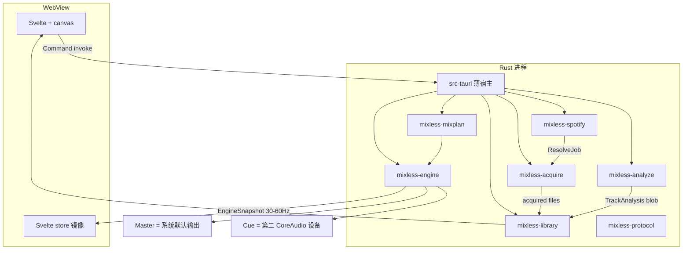
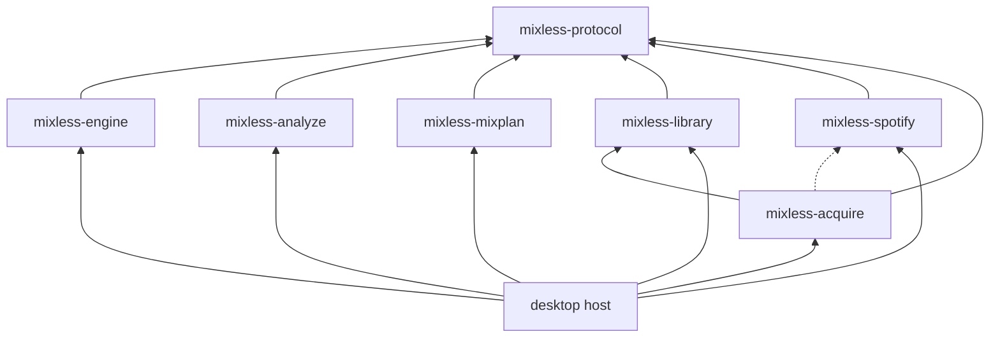
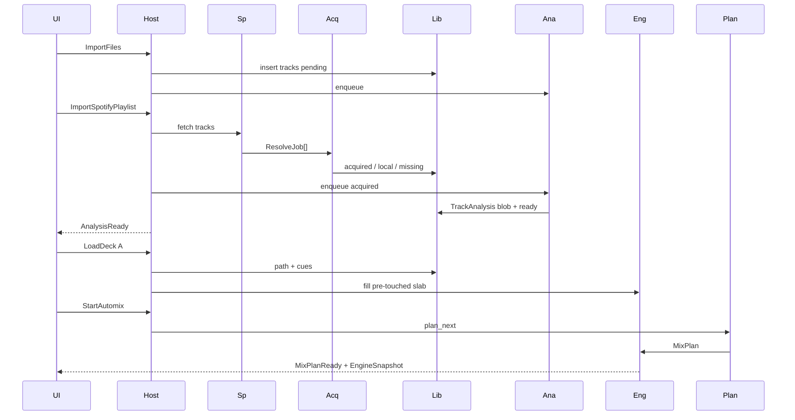

# 01 — 系统架构

## 单进程，多线程

v1 不拆 audio helper 进程。Tauri 2 宿主拉起引擎、库、分析池、规划器；WebView 只画界面。



`apps/desktop/src-tauri` **禁止**写 DSP。

## Crate 边界

```
apps/desktop/
crates/mixless-engine
crates/mixless-analyze
crates/mixless-mixplan
crates/mixless-library
crates/mixless-spotify      # 浏览，无音频字节
crates/mixless-acquire
crates/mixless-acquire-yt
crates/mixless-protocol     # 含 TrackAnalysis
models/
third_party/                # Signalsmith、yt-dlp
private/                    # 闭源 CDN 插件
```



**没有** `mixplan → analyze`。Planner 只反序列化 `protocol::TrackAnalysis`。`engine` 不得依赖 `analyze` / `spotify` / UI。

## 线程模型

| 线程 | 职责 | 硬约束 |
|------|------|--------|
| `audio-callback` | playhead/loop → ring → stretch 或 resample → insert/EQ/send/xf | 128/256 frames；无分配、无 syscall、无 mmap 新页、无 `read_at` |
| `decode-a` / `decode-b` | 解码并 **预触碰** f32 slab | 可分配；禁止进 callback |
| `analysis-pool` | 独立 decode + 分析 | 可取消 |
| `planner` | 下一 1–2 对 | 失败 fallback |
| `acquire-pool` | sidecar、落盘、打标签 | 可取消；杀子进程 |
| Tokio / tauri-main | IPC、OAuth、SQLite、FS | 不碰 PCM |
| WebView | 渲染 | 只消费 Event |

参数：SPSC `try_recv`。自动化 double-buffer。欠载：重复上一块 + xrun。

## 数据流



## 设备 I/O 与采样率

- `cpal` + CoreAudio。**v1 只做 macOS**。
- Master：系统默认输出。耳机：设置里选的第二输出。无第二设备 → **只禁用 PFL**，Hot Cue 不受影响。
- 音频时钟 = Master callback。耳机 callback 只从 lock-free `CueRing` 取数，不做 DSP。
- PFL：Mixer 上 PFL 亮的碟在 channel fader **之前**抽到耳机总线，与 Master 混音无关。
- **图跑 Master 设备原生 SR**。`Engine::new(actual_sr)` 按该 SR 预分配，上限 **96 kHz**。Cue 设备 SR 不同则在写入 `CueRing` 前用预分配 SRC（仅 cue 路径，不进 Master DSP 节点）。
- DSP 节点内不做 SRC。
- 默认设备或 SR 变化：非 callback `fade → stop → 按新 SR 重分配 → start`。
- 顶栏显示 Master / Cue 设备名。

## 音频源

与主文档 §4.5 **逐字相同**：

```rust
pub trait AudioSource: Send {
    fn id(&self) -> SourceId;
    fn sample_rate(&self) -> u32;
    fn channels(&self) -> u16;
    fn frames(&self) -> Option<u64>;
    /// 非实时：只允许 decode 线程。Callback 调用 = 缺陷。
    fn read_at(&mut self, frame: u64, dst: &mut [f32]) -> usize;
    fn can_seek(&self) -> bool;
}
```

Callback 只看见预触碰 `AudioRing`。禁止 file-backed mmap 上音频线程。v1 只有 `LocalFileSource`（手导 + acquired 文件）。获取层把远程渠道物化成文件后，引擎无感知。

整轨 4 min 44.1 k stereo f32 ≈ 85 MB。>15 min 滑窗 ±30 s，仍须预触碰。

图顺序：**Cache → Playhead+Loop → Stretch/Resample → EQ → Insert → Send tap → Fader → XF**。

## 播放真相

`EngineSnapshot`（含 `frame/beat/bar`）@ 30–60 Hz 是唯一时间线。Jog 以 **4–8 ms** 合并的 `delta_frames` 发送。
