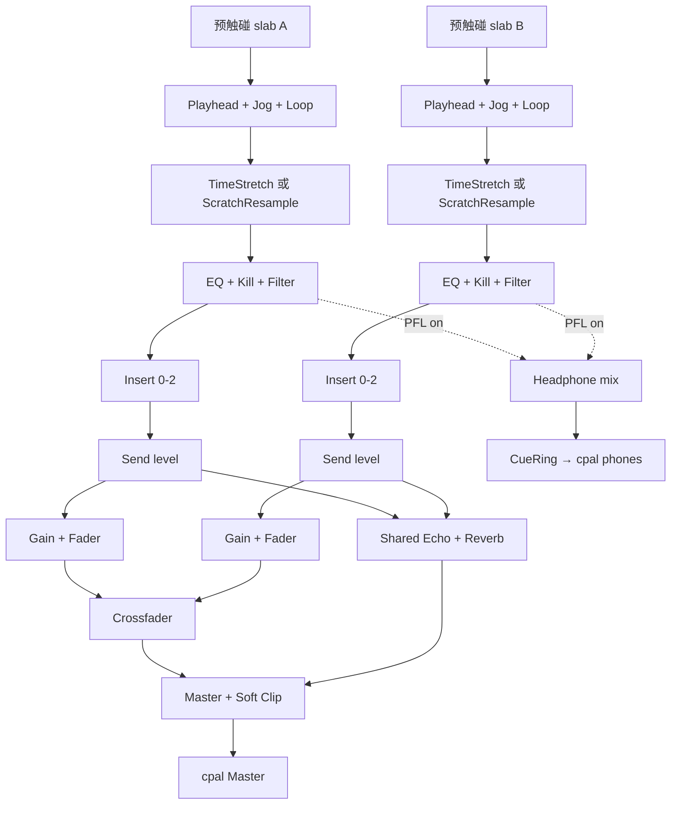

# 03 — 实时音频管线

## 决策

实时图 100% 在 `mixless-engine`。Web Audio 不是播放引擎。禁止每帧 JSON IPC 传 PCM。

- I/O：`cpal` + CoreAudio，**仅 macOS**。Master = 系统默认；Cue = 第二设备。图跑 **Master 原生 SR**，预分配按 `actual_sr`，上限 96 kHz。DSP 节点内无 SRC。
- Time-stretch：`TimeStretch` trait，默认 Signalsmith **音乐档**；Rubber Band 仅 feature。
- Scratch：**重采样播放头**，无 STFT。
- Loop 在 stretch **之前**。
- Callback 只读预触碰 ring；`AudioSource::read_at` 非实时。

## 实时图



块：稳跑默认 256；jog SLA 用 128。内部 `f32` stereo interleaved。

## Callback 约束

禁止：分配、文件 I/O、mmap 新页、`mutex.lock`、`format!`、syscall、`AudioSource::read_at`。

欠载（全图契约）：重复上一块 + `xrun++`。

Cue / loop xf 是 **多块状态机**（默认 6 ms = 288 frames @ 48 k > 256 帧块），剩余样本跨 `process_block` 携带。

## 两个 stretch 工作点

| 档 | 算法 | 延迟 | 何时 |
|----|------|------|------|
| 音乐 | Signalsmith + `splitComputation` | 20–40 ms | play / SYNC / Automix |
| scratch | 线性/hermite 重采样 | 0–2 ms | vinyl、高 |jog| |

包装：`n_in = round(n_out * rate)` 从 ring 取；音高 `setTransposeSemitones`；cue 时 `seek` + 预卷 `inputLatency`；`process` 不分配；`set_rate_pitch` wait-free 或块边界生效。可用 vendored cxx 或 crates.io `signalsmith-stretch`。

Vinyl 切入/切出：按两档 `latency_frames` 差补偿播放头 + 2–6 ms xf，click-free。

## Seek / Loop

- Loop 窗口在 **源 / tempo-map 域**。rate 变，4 bar 仍是 4 个乐句 bar。
- 跳转与 wrap：2–10 ms equal-power，默认 6 ms，多块。
- `LoopHalve` / `LoopDouble` 吸附 grid。

## EQ / XF / FX

完整目录、参数、CPU 预算见 [10-mixer-fx.md](./10-mixer-fx.md)。摘要：

- 3-band isolator + kill；channel filter；XF 四条曲线 + reverse；master limiter。
- 每碟 **4 insert**（Gate / Flanger / Phaser / Crush / Dist / Chorus）。
- 共享 Echo（含 echo-out freeze）+ Reverb。
- 传输类：Roll / Reverse / Brake。`mix==0` 整段 bypass。
- Delay / FDN / limiter 全部按 `actual_sr` 预分配。

## Hot Cue vs PFL

- **Hot Cue**：`JumpCue` / `SetCue`，与输出设备无关，永远可跳，缺口 < 8 ms。
- **PFL**：Mixer 键 `SetPfl`。亮 = 该碟在 fader 前进入耳机总线。
- 两碟 PFL 都亮：耳机总线 1:1 相加后限幅。
- 耳机音量 `SetCueGain`，不影响 Master。
- 无第二设备：**只禁用 PFL**。热键跳转验收不得因此失败。
- Master callback 写 `CueRing`；耳机 callback 只 memcpy。耳机欠载不计 Master xrun。

## 延迟预算（从硬件往上）

48 kHz：`T(128)=2.67 ms`，`T(256)=5.33 ms`。

**v1 jog（scratch，128 帧）**：

```
coalesce 4–8 ms
+ IPC ~1 ms
+ wait-for-block 0–2.67 ms
+ device buffer 2.67 ms
+ scratch resample 0–2 ms
= typical 7.7–16.3 ms
+ WebView/OS 偏移
→ 验收 p99 < 30 ms（内部 p50 < 25 ms）
```

禁止 16 ms 合并。256 帧稳跑 typical ≈ 16–22 ms，不作为宣传 SLA。

| 路径 | v1 |
|------|-----|
| Jog → 声 | **p99 < 30 ms** @ 128 / scratch |
| Cue 缺口 | < 8 ms |
| 音乐 stretch | 20–40 ms |
| Scratch | 0–2 ms |
| `< 10 ms` 往返 | **P1**（stretch-bypass + 原生指针，不经 WebView） |
| xrun | < 0.01% |
| Callback p99 全 FX | **< 50%** of 256-frame block |
| Callback p99 scratch | < 35% of 128-frame block |

## 可视化

`EngineSnapshot` 30–60 Hz（含 playhead）。`Meter` 30 Hz。Waveform 走分析 blob。
