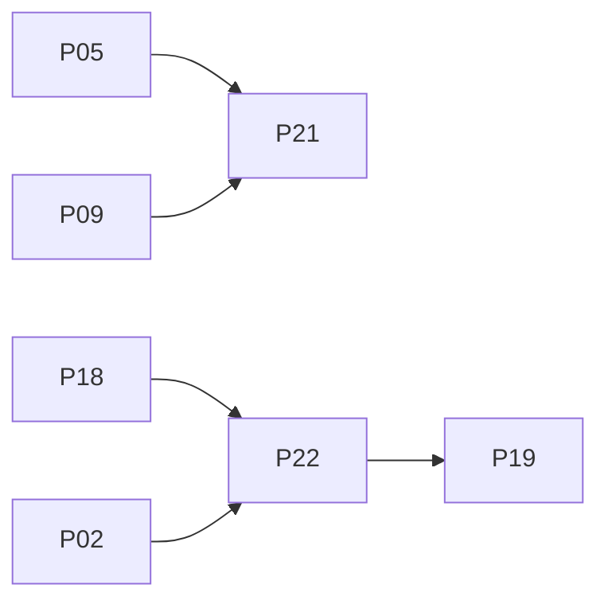

# 08 — 路线图

原则：**先能出声且不爆音，再分析上屏，再自动混，再 Spotify 浏览 + 获取。** Automix 永远可关。v1 只验收 **macOS**。

**人力**：2 名全职时，M1–M2 ≈ **12–16 工程师·周**（含 headphone cue）；完整 v1 ≈ **7–9 个月**。

## 里程碑

### M0 — 骨架（PR01）

Workspace（Apache-2.0）、`mixless-protocol`、空 Tauri 壳（macOS）。

### M1 — 出声（PR02–PR05）

SQLite 导入；`cpal` CoreAudio；`render_offline`；decode 预触碰 slab；双碟 EQ/xf。

**验收**：两首本地文件能混；seek 无咔哒；切默认设备不炸。

### M2 — DJ 手感（PR06, PR07a/b, PR08, PR09, PR13, **PR21 cue**）

Signalsmith；playhead+loop；vinyl/slip；insert+send；2-deck 壳 + **SYNC + 真 CUE**；8 hot cue。

**验收**：jog p99 < 30 ms；Hot Cue 跳转 < 8 ms（**无耳机设备也必须过**）；有第二输出时 PFL 不进 Master。全 FX 全开 callback p99 < 50% block。

### M3 — 库可视化（PR10, PR11a, PR12）

Metadata、`MLWF`、全局 BPM+key、library 表。

### M4 — 结构（PR11b, PR14）

PELT、逐 bar、ONNX/规则、自动 cue。

### M5 — Automix（PR15–PR17）

节点表 + 归一化分 + `PerformanceOffset` + UI。

### M6 — Spotify 浏览 + 获取（PR18, PR19, **PR22 acquire**）

PKCE 浏览；YTM/yt-dlp sidecar；时长窗；acquired 入资料库再分析。闭源 CDN 插件不进此里程碑。

### M7 — 硬化（PR20）

jog 计时、xrun、包络金样、获取误匹配夹具。

## 新增 / 调整的 PR

| # | Title | Depends | Description |
|---|---------|---------|-------------|
| PR21 | feat(engine,ui): PFL phones | PR05, PR09 | 第二 CoreAudio、`CueRing`、`SetPfl`；无设备只禁 PFL，Hot Cue 仍跳 |
| PR22 | feat(acquire): YTM sidecar | PR18, PR02 | `mixless-acquire` + `mixless-acquire-yt`；时长窗；lofty 标签；进度 UI |

原 PR19（matcher + missing UX）改为：匹配本地 → 否则丢给 PR22。

## PR 依赖（增量）

其余依赖见主文档 PR Plan。顺序仍是：出声 → 手感（含预听）→ 库 → 结构 → automix → Spotify/获取。

## v1 之后

手动 beat grid、watch-folder、smart shuffle、streamrip、Soulseek、闭源 CDN 插件、MIDI、stems、Windows、4 deck。

## 回滚

关 Automix / 获取 / ONNX。音频从 PR03 起即可 `render_offline` 回归。
