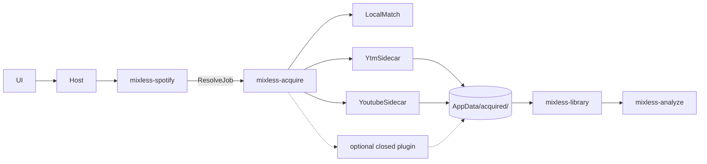

# 09 — 曲目获取（Spotify 歌单 → 本地音频）

用户决策（2026-08-15）：**不申请 Spotify DJ Partner**。Spotify 只负责歌单整理；混音对象必须是落在磁盘上的本地文件。获取层负责把 playlist 里的每一首解析成可分析、可加载的音频文件。

官方 Web API **不提供 PCM**。因此获取 = **用 Spotify 元数据去别的渠道找同一首录音**，成功后写入 AppData 并导入资料库。

## 产品语义

```
登录 Spotify → 看到 playlist（封面、曲名、ISRC、时长）
     → 点「导入 / 获取」
     → Resolver 按优先级试渠道
     → 命中则落盘、打标签、入资料库、排队预分析
     → 失败则标 missing，允许换源或手动指定文件
```

Deck **永远只加载本地文件**。获取完成前不能出声。

## 渠道调研（GitHub / 业界，2026-08）

| 优先级 | 渠道 | 代表项目 | 实际音频从哪来 | 匹配键 | 典型码率 | 说明 |
|--------|------|----------|----------------|--------|----------|------|
| 0 | 已有本地库 | 本应用 matcher | 用户磁盘 | ISRC；否则 title+artist+duration 三项全中 | 原文件 | 永远先查，避免重复下 |
| 1 | YouTube Music | [spotDL/spotify-downloader](https://github.com/spotDL/spotify-downloader)、[yt-dlp/yt-dlp](https://github.com/yt-dlp/yt-dlp)、[sigma67/ytmusicapi](https://github.com/sigma67/ytmusicapi) | YTM 音轨，不是 Spotify CDN | 艺人+曲名搜索，时长过滤 | 约 128 kbps（普通）/ 256 kbps（YTM Premium cookie） | **v1 默认获取通道**。spotDL 已验证「Spotify 元数据 + YTM 搜索」这条路 |
| 2 | YouTube | yt-dlp `ytsearch` | 视频音轨 | 更宽搜索 | 128–251 kbps | YTM 无结果时的回退。误匹配率更高（现场、1 小时混音、加速版） |
| 3 | SoundCloud / Bandcamp | spotDL 的 `soundcloud` / `bandcamp` provider | 对应站点 | 标题搜索 | 不定 | 独立厂牌、白标更好；主流流行命中差 |
| 4 | 用户自备高品质订阅库 | [nathom/streamrip](https://github.com/nathom/streamrip)（Qobuz / Tidal / Deezer） | 用户自己的账号 | ISRC | 常达 FLAC / 320 | **P1**。用户另有账号时质量最好，不碰 Spotify CDN |
| 5 | P2P | [slskd/slskd](https://github.com/slskd/slskd) + Lidarr 类索引 | Soulseek | 文件名 | FLAC 常见 | **P2**。延迟高、需人工确认 |
| 6 | Spotify CDN（直连） | [librespot-org/librespot](https://github.com/librespot-org/librespot)、[zotify-dev/zotify](https://github.com/zotify-dev/zotify)、[glomatico/votify](https://github.com/glomatico/votify) | Spotify 加密流解密后的 Ogg Vorbis | Spotify track id，无匹配误差 | 160 / 320 kbps（Premium） | **可选闭源插件**。账号封禁与协议变更风险最高，不进 Apache-2.0 主树 |

**不采用**

- Web Playback SDK：加密、无 PCM、无法双碟 DSP。
- 官方 DJ Partner SDK：用户判定申请不到。
- 把 spotDL / zotify 当子进程黑盒长期依赖而不做匹配门槛：现场版、清洁版、1 小时混音会毁掉 beat grid。

## 架构

```
crates/mixless-spotify          Apache-2.0   浏览 + 元数据，零音频字节
crates/mixless-acquire          Apache-2.0   Resolver、打分、落盘、打标签
crates/mixless-acquire-yt       Apache-2.0   YTM / YouTube：拉起 yt-dlp sidecar
private/mixless-acquire-cdn     专有闭源     可选 Spotify CDN 后端，独立仓库/二进制
```

主应用 **Apache-2.0**。CDN 插件用动态加载或旁路二进制接入，源码不进开源树。



引擎、分析器、规划器 **不知道** 文件从哪来。它们只看见 `LocalFileSource`。

## ResolveJob

```rust
pub struct ResolveJob {
    pub spotify_id: String,
    pub isrc: Option<String>,
    pub title: String,
    pub artist: String,
    pub album: Option<String>,
    pub duration_ms: u32,
    pub artwork_url: Option<String>,
}

pub struct Candidate {
    pub source: AcquireSource,      // Local | YoutubeMusic | Youtube | Soundcloud | Cdn | Manual
    pub locator: String,            // 本地 path 或 sidecar 可取的 id
    pub duration_ms: u32,
    pub confidence: f32,            // 0..1
    pub bitrate_hint_kbps: Option<u16>,
}

pub trait AudioAcquire: Send + Sync {
    fn name(&self) -> &'static str;
    fn search(&self, job: &ResolveJob) -> Result<Vec<Candidate>, AcquireError>;
    fn materialize(&self, job: &ResolveJob, cand: &Candidate, dest: &Path) -> Result<PathBuf, AcquireError>;
}
```

## 默认链（v1）

1. `LocalMatch` — 与 [06-spotify.md](./06-spotify.md) 同一套 normalize。ISRC 命中即停。
2. `YoutubeMusic` — 搜索 `" {artist} {title} "`，必要时再试 ISRC 字符串。
3. `Youtube` — 仅当 YTM 最高分 < 0.72。
4. 用户从候选列表里手选，或粘贴任意可被 sidecar 取到的 URL。
5. `CdnPlugin` — 仅当用户在设置里打开闭源插件。

并发：playlist 导入默认 2 路，可配 1–4。失败指数退避。单曲超时 90 s。

## 匹配门槛（DJ 比「能放」更严）

spotDL 已知会下到现场版、清洁版、1 小时混音（见 spotDL#1563、#2021）。Automix 依赖时长和结构，必须先滤：

```
dur_ratio = |cand.duration_ms - job.duration_ms| / job.duration_ms
title_ok  = normalize(cand.title) == normalize(job.title)
            或包含关系且无 live/sped up/nightcore/hour mix 标记
penalty   = live|remix(曲名无 remix)|mix|hour|slowed|sped 则 −0.4

score = 0.45 * title_sim
      + 0.25 * artist_sim
      + 0.30 * (1 - min(dur_ratio / 0.06, 1))   // ±6% 时长窗
      + penalty
```

- `score < 0.72`：不自动落盘，列出候选让用户点。
- `|Δt| > 5 s`：禁止自动采用（beat grid 会整体错位）。
- 时长 > `job.duration * 1.25` 或 > 12 min：丢弃（排除可视化混音、DJ set）。
- 落盘后用 `symphonia` 再读真实 duration；与 Spotify 差 > 5 s 则标 `suspect`，不自动进 Automix 队列。

## sidecar 约定（YTM / YouTube）

不把 yt-dlp 链进 Rust。打包官方 yt-dlp 可执行文件，用 JSON 行协议拉起：

- 工作目录与 cookie 文件只在用户机器。
- 输出：单文件 + 伴随 `.json`（source url、id、abr）。
- 容器优先 opus/m4a，再由我们用 lofty 写入 Spotify 的 title/artist/album/ISRC/封面。
- 路径：`~/Library/Application Support/Mixless/acquired/{spotify_id}.{ext}`。
- 同一 `spotify_id` 已存在且 duration 合格 → 直接复用。

具体命令行参数由 `mixless-acquire-yt` 封装；UI 与 engine 不得拼命令。

## 闭源 CDN 插件

- 独立仓库 / 独立二进制，**不是** Apache-2.0。
- 主应用只通过 `AudioAcquire` + C ABI / 本地 socket 调用。
- 默认关闭。打开时设置页写明：协议非官方、账号可能被 Spotify 限制、不随开源发行。
- 主仓库 CI **禁止** 出现 librespot / zotify / votify 依赖。插件自己维护。

## 质量与分析

## 当前接入状态（2026-09）

- Spotify 新下载的音频及伴随 JSON 保存到用户选择的下载目录下，以歌单名建立一级子目录；未选择目录时使用应用的 `acquired/`。中文和普通名称保持可读，路径分隔符、非法字符、保留名、空名和过长名称经过处理。已有本地匹配仍复用原文件，不自动迁移历史下载。下载器在该子目录的独立 staging 中执行，歌单名不参与输出模板或环境变量展开。
- 歌单中的 missing/suspect 行在 Remove 旁显示 Retry。重试只处理所选行，使用已保存的录音元数据和当前歌单名，不重新拉取或替换整张歌单；本地匹配、下载、解码及时长校验复用首次导入流程。重试使用独立队列，最多 4 首并行，只有已提交的行显示等待/执行状态，其他失败行仍可点击。Spotify 歌单有失败项时，右键菜单显示 Retry all failed tracks；未选中的歌单也可操作。批量与单曲重试共享队列，跳过成功/处理中项并合并重复提交；重复录音依次复用文件，避免同时写入同名下载。再次失败保留新错误并允许重试；已删除的行或歌单不会被迟到结果恢复。
- 本地导入先 canonicalize、解码并完整分析；分析失败或文件在分析期间发生变化不会写入 ready 状态。重复导入同一路径复用 track，但文件 hash 变化会清空旧 BPM/key/analysis。
- Spotify 导入按远端 playlist ID 建立稳定映射，保留原始顺序和 missing/suspect 原因。只有本地匹配或实际解码成功的 acquired 文件进入 `playlist_items`。
- 封面由独立后台任务按已保存的 Spotify track ID 调用公开 oEmbed 获取，启动时补齐历史下载，导入/重试完成后继续补齐；保留现有内嵌/缓存封面。图片经过响应大小、解码尺寸限制和验证后原子写入 artwork 缓存，不改写音频或使 BPM/波形/stems 缓存失效。重复导入保留同一音频 hash 的远端封面；迟到结果不能覆盖已变更录音。封面失败不改变歌曲导入状态，网络故障与 429 限流退避后自动重试。
- `yt-dlp` sidecar 先获取候选 metadata，再按录音版本、艺人、标题和时长门槛选择；下载在 staging 目录完成后以 Spotify track ID 原子发布，90 秒超时会回收子进程。当前 fallback 搜索 YT；YTM 搜索接口变化时会报告具体错误并保留 missing 行。
- 当前 UI 可直接导入公开 Spotify playlist；私人 playlist 需要先完成桌面 OAuth/Keychain 接入，不能仅靠粘贴链接绕过权限。

| 来源 | 对 BPM / 波形 / Automix | UI |
|------|-------------------------|----|
| 用户 FLAC / 320 | 基准 | 无标记 |
| YTM 256 | 可用 | 黄点「获取 · 256k」 |
| YTM/YT 128 | 能分析，高频毛刺 | 黄点「获取 · 128k」 |
| suspect | 禁止自动进 Automix | 红点，需确认 |

获取文件与手导文件走同一条 `mixless-analyze` 队列。

## 失败与 UX

- 整表进度：`queued / searching / downloading / tagging / analyzing / ready / missing / suspect`。
- 单曲失败保留原因：`no_candidate` / `duration_mismatch` / `timeout` / `source_error`。
- 支持「只获取缺失」「重试失败」「换源」。
- 磁盘预算：默认 acquired 上限 20 GB，超出停并提示。

## 安全

- sidecar 无网特权以外的权限；只写 `acquired/`。
- cookie / Spotify token 只进钥匙串，不进 SQLite。
- 不把用户音频上传云端。
- 获取任务可取消；取消必须杀掉 sidecar 子进程。
