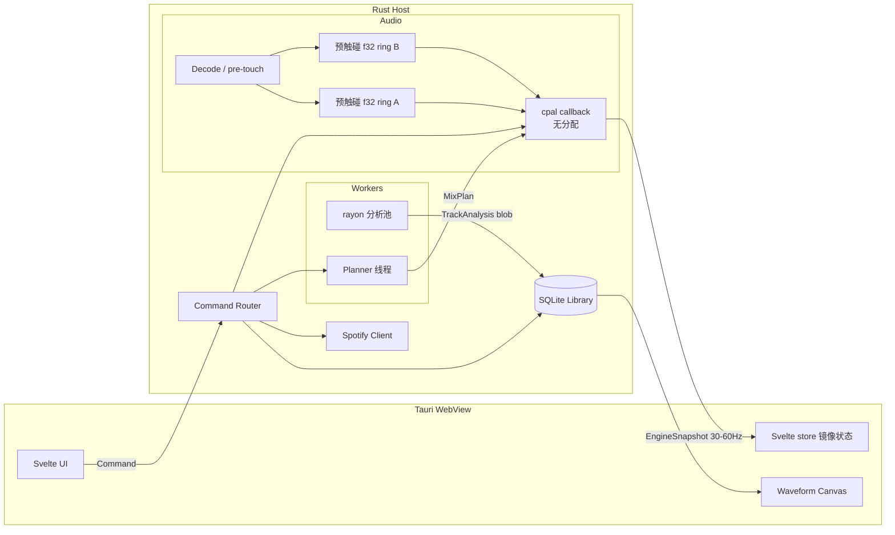
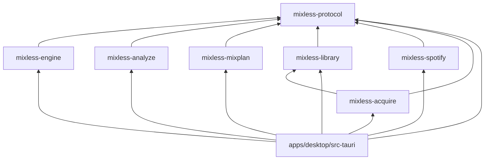
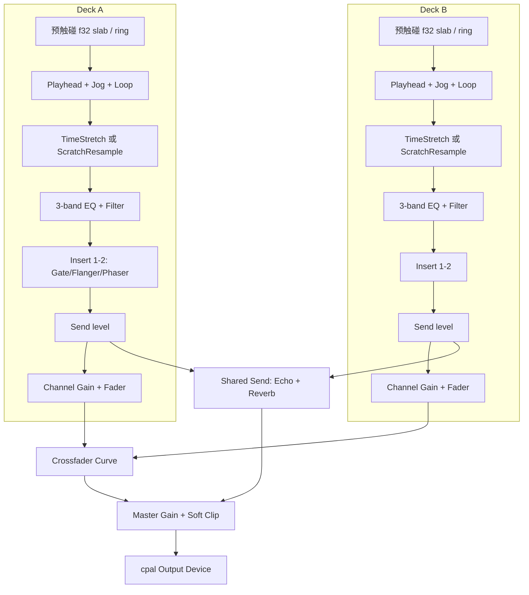
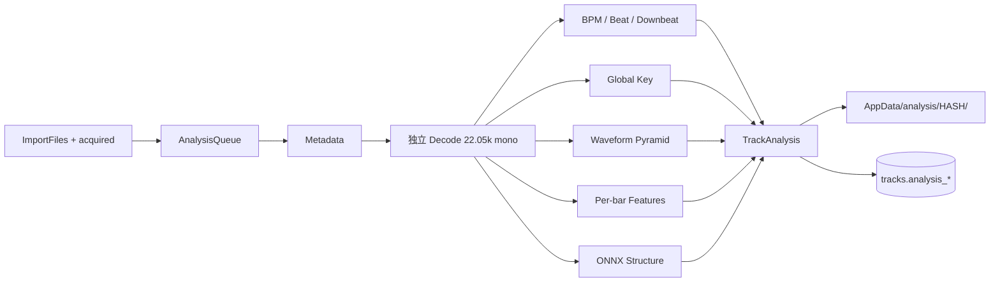
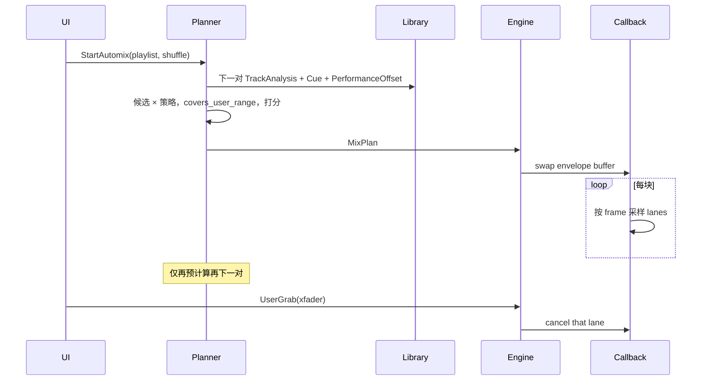

# Mixless 系统设计文档

| 字段 | 值 |
|------|-----|
| 标题 | Mixless：基于 Tauri 的本地 AI Mixing / AI DJ 桌面应用 |
| 作者 | TBD |
| 日期 | 2026-08-15 |
| 状态 | Draft |
| 版本 | 0.3.1 |
| 仓库 | `/Volumes/BRData/projects/mixless`（greenfield） |

---

## Overview

Mixless 是一款 Tauri 2 桌面 DJ 应用：两个拟物唱盘、完整本地资料库、离线预分析、以及按播放列表自动规划过渡的 AI Mixing。产品目标是复刻 djay Pro / Serato / rekordbox / Traktor 的专业双碟工作流，但把计算密集路径全部放在 Rust，WebView 只负责渲染。

仓库当前为空。本文定义目标架构、crate 边界、实时音频图、分析算法、AI Mixing 规划器、Spotify 合法接入策略、SQLite 数据模型、命令/事件协议，以及可独立 review 的 PR 序列。核心约束有三条，后文不再摇摆：

1. **实时音频图 100% 在 Rust**。Web Audio 不是播放引擎；禁止每帧 JSON IPC 传 PCM。
2. **Deck 只加载本地文件**。Spotify 只提供歌单元数据；音频由获取层（默认 YouTube Music / yt-dlp 路线）物化到磁盘后再分析、预听、混音。
3. **v1 只做 macOS**。主仓库 Apache-2.0；Spotify CDN 直连若实现，必须是闭源插件。

---

## Background & Motivation

主流 DJ 软件（djay Pro、Serato DJ、rekordbox、Traktor）的工作流已经稳定十年以上：双唱盘 + mixer + 彩色 waveform + hot cue + loop + 独立 time-stretch/pitch + 离线分析库。用户要的是这套手感，再加一层“按列表自动混、听起来像人”的 AI Mixing。

当前仓库是空的，没有遗留包袱，也没有可复用引擎。若把播放丢给 Web Audio，jog scratch、独立变速变调、cue-accurate seek、系统默认设备热切换都做不到 DJ 级延迟。用户明确：不申请 Partner，歌单用 Spotify 整理，音频必须从其他渠道落到本地。获取层与引擎解耦：引擎永远只看见文件。

痛点（对标现有软件 + 本产品增量）：

| 痛点 | 现有软件 | Mixless 立场 |
|------|----------|--------------|
| 双碟 + 搓碟 + 独立 stretch/pitch | 标配，原生引擎 | 自研 `mixless-engine`，Rust callback |
| 资料库预分析 | 标配 | 本地 SQLite + AppData 分析产物 |
| Spotify 进碟 | 仅三家官方合作能混流 | 浏览歌单 + 获取层物化本地文件 |
| 自动混音 | djay Automix / rekordbox 部分 | 可评分过渡目录 + 包络渲染，可接管 |
| 分段 BPM / 结构 / 逐 bar 特征 | 各家深浅不一 | 作为 AI Mixing 的一等输入，必须可实现 |

---

## Goals & Non-Goals

### Goals（v1 必须交付）

- 双唱盘：jog / vinyl scratch、vinyl/slip 模式、每轨 8 个 hot cue、1/2/4/8/16 bar loop、一键 SYNC（对齐对面碟 sounding BPM + 下一 downbeat，可选 keylock）。
- 资源管理器：本地**显式导入** + 文件夹树 + playlist；Spotify Premium OAuth 浏览；未匹配曲目走获取链（YTM 默认）。Watch-folder 为 P1。
- PFL：第二 CoreAudio。无该设备不能预听，Hot Cue 仍可跳转。
- 完整 mixer + FX 目录见 `.agents/10-mixer-fx.md`。全开仍要过 callback 预算。
- 本地文件 metadata 解析与展示。
- 离线预分析：单 BPM 与分段动态 BPM、主调性、彩色 waveform、按小节频谱、结构段、逐 bar 特征。
- Mixing 工作台：两碟 + 3-band EQ + channel fader + crossfader + master；独立 key/pitch 与 BPM time-stretch。
- 效果器：每碟 4 insert + Echo/Reverb send + Roll/Reverse/Brake。
- AI Mixing：按列表顺序（可 shuffle）规划**下一 1–2 对**过渡；无显式 mix-in/out 时自动选点；有 `kind=in|out` 时按分轨约束只可向外扩展；hot cue 只作软锚；输出 bar-quantized 自动化包络。
- 默认输出：系统默认设备，跟随系统；device-change 热切换。
- 延迟：v1 jog **< 30 ms p99**（128 frames，scratch 重采样路径）。算术见 §4.7。

### Non-Goals（明确不做）

- 4 decks（v1 只有 2）。
- DVS / timecode vinyl。
- Stem separation / Neural Mix（可列 P2）。
- MIDI 控制器（P1 评估，不进 v1 验收）。
- 移动端 / Web 托管版。
- 开源树依赖 librespot / zotify / 直接链 Spotify CDN。
- 云同步资料库（P2）。
- 用 Web Audio 做主混音。
- 把用户音频默认上传到云端分析。
- v1 watch-folder 自动扫描（P1）。
- v1 Windows。

### 约束

- 计算密集路径在 Rust，尽量多用线程；前端只渲染。
- 分析默认全本地；ONNX 模型随 app resources 分发。
- 仅 Spotify Premium 可连接账号（Free 账号 UI 拒绝并说明原因）。
- 目标平台：**macOS only（v1）**。
- 许可：主仓库 Apache-2.0。CDN 获取 = 闭源插件。

---

## Key Decisions

| # | 决策 | 理由 |
|---|------|------|
| D1 | 实时音频图 100% Rust（`mixless-engine` + `cpal`）。Web Audio 不做播放引擎。 | WebView + IPC 无法稳定 jog、独立 stretch/pitch、跨设备。v1 jog SLA 是 **< 30 ms p99 @ 128 frames / scratch 重采样**，不是 <10 ms。`<10 ms` 仅作 P1 目标：stretch-bypass + 128 帧 + **非 WebView** 指针钩子。 |
| D2 | Time-stretch / pitch 默认 **Signalsmith Stretch**（MIT），抽象为 `TimeStretch` trait；Rubber Band 仅作为可选商业许可后端。两个工作点：音乐档 20–40 ms + `splitComputation`；scratch 档 0–2 ms 重采样（无 STFT）。 | 需要独立 rate/pitch。Rubber Band GPL/商业双许可会绑架发行。Scratch 不得走 STFT。 |
| D3 | Decode 用 `symphonia`。**播放**预解码到 **预触碰（pre-faulted）RAM `f32` 交错 slab**，禁止 callback 路径 file-backed mmap。**分析**独立 decode 并降到 22.05 kHz mono，v1 **不**复用播放 cache。 | mmap 首次触碰是 page fault（syscall）→ xrun。分析与播放采样率/通道不同，同源文件即可，不必同源缓冲。 |
| D4 | 分析：传统 DSP 用 Rust；结构/功能段用本地 ONNX Runtime（`ort`）。 | BPM/key/waveform 不需要深度学习即可达可用；结构段用 All-in-One / Harmonix 风格模型更稳，且必须离线。 |
| D5 | Spotify = 歌单目录。播放/分析只针对本地文件。未匹配时走获取层（默认 YTM / yt-dlp sidecar）。不申请 Partner。 | 用户要的是歌单便利，不是官方流。Web API 无 PCM。详见 `.agents/09-acquire.md`。 |
| D6 | Library 用 SQLite；分析产物存 AppData。内容哈希 = `blake3(len \|\| mtime \|\| first_64k \|\| last_4k)`，**不含 inode**。 | 含 inode 时复制文件会假 miss。大二进制不进 SQLite。 |
| D7 | AI Mixing 两阶段：`MixPlanner` 只提前规划 **1–2 对** + `AutomationRenderer`（bar-quantized 包络，音频线程 lock-free 读）。`plan_playlist` 仅测试辅助。 | 全列表预规划在 `energy_hold` / takeover 后立刻过期。 |
| D8 | 前端 Tauri 2 + **Svelte 5** + SCSS + canvas waveform；Svelte store 只镜像，**播放真相在 Rust**。`EngineSnapshot` 含 playhead，30–60 Hz 推一次。 | 用户指定 Svelte+SCSS；高密度拟物用组件+SCSS，waveform 自己画。 |
| D9 | Master = 系统默认。**PFL 进 v1**（第二 CoreAudio）。无第二设备 **只禁 PFL**。Hot Cue 跳转与监听设备无关。 | 用户：没耳机也要能跳到 cue 点，只是不能预听。 |
| D10 | 只有 `kind=in\|out` 硬约束规划器，且 **分轨**：A 的 out 与 B 的 in 分开判定。Hot cue 只是软锚（±2 bar 内加分），**不是** `[first hot, last hot]` 最小跨度。v1 右键可设 mix-in / mix-out。 | 把 8 个 hot cue 当必须覆盖的区间会逼出整轨 blend，Automix 名存实亡。 |
| D11 | Mixer / FX 按 `.agents/10-mixer-fx.md` 齐备：isolator+kill、filter、4 insert、Echo/Reverb send、Roll/Reverse/Brake。全开 callback p99 < 50% block。不用 `fundsp` 当 mixer 核心。 | 用户要求能力齐备且性能优秀；bypass 与预分配是前提。 |
| D12 | v1 只 2 deck；shuffle 只打乱顺序；生产路径每次只规划下一 1–2 对。 | 范围控制；smart shuffle 列为 P1。 |
| D13 | v1 提供一键 **SYNC**：把本碟 sounding BPM 贴到对面碟，并量化到对面下一 downbeat；可选 keylock（只改 rate 不改 pitch）。 | 手动 `SetRate` 不是专业双碟工作流；Automix 不能代替人手 SYNC。 |
| D14 | Vinyl / scratch 路径 = 播放头积分 + 线性重采样，**无 STFT**。切入/切出用延迟补偿短 xf，click-free。 | 音乐 stretch 的 20–40 ms 窗会毁掉搓碟；裸切会按 `inputLatency+outputLatency` 跳。 |
| D15 | 图运行在 **Master 设备原生采样率**，预分配按 `Engine::new(actual_sr)`，上限 96 kHz。v1 仅 CoreAudio。DSP 节点内不做 SRC。Cue 设备 SR 不同只在 CueRing 入口预分配 SRC。 | v1 不做 Windows。 |
| D16 | 2× 速度匹配默认是 **2:1 bar 映射、rate≈1**，不是 0.5×/2.0× stretch。打分用 **sounding** BPM/key：`bpm_at_beat * offset.rate`、`key.shift(offset.pitch)`。2:1 墙钟：两个快 bar = 一个慢 bar。 | Signalsmith 在 0.5/2.0 听感发糊；DJ 的 half-time 是乐句对齐。分析 BPM 在 `energy_hold` 后不再等于出声网格。 |
| D17 | Mix 时钟：master = **出碟**（outgoing），除非策略声明相反。`length_bars` 按 master grid 计。入碟带 `PerformanceOffset` 进入下一对。 | 重叠期必须有单一 transport；`energy_hold` 后下一对必须看到 sounding 网格。 |
| D18 | Loop 在 stretch **之前**（源播放头、tempo-map 帧）。`AudioSource::read_at` **不是** 实时安全；callback 只读预填 lock-free ring / 预触碰 slab。欠载：重复上一块 + xrun。 | Loop-after-stretch 使窗口域歧义；callback 里 `read_at`/mmap 会 xrun。 |
| D19 | 获取默认链：LocalMatch → YouTube Music → YouTube。时长窗 ±5 s / 分 < 0.72 不自动采用。 | 对齐 spotDL 路线，但加上 DJ 级误匹配过滤。 |
| D20 | 主仓库 Apache-2.0。Spotify CDN / librespot 类实现仅允许闭源插件，默认关，不进开源树。 | 用户指定许可；隔离账号/协议风险。 |
| D21 | v1 只验收 macOS。 | 用户拍板。 |
| D22 | yt-dlp 以 sidecar 可执行文件接入，不链进 Rust。 | 进程隔离、可杀、许可清晰（yt-dlp Unlicense）。 |

---

## Proposed Design

### 1. 仓库布局

```
/Volumes/BRData/projects/mixless/
  .agents/                      # 本设计套件
  apps/desktop/                 # Tauri 2 应用
    src/                        # Svelte 5 + SCSS UI
    src-tauri/                  # 薄宿主：window、command 转发、权限
    capabilities/               # Tauri 2 ACL
  crates/
    mixless-engine/             # 实时音频图、设备 I/O、jog/loop/fx
    mixless-analyze/            # 离线分析 worker
    mixless-mixplan/            # AI mix planner + envelope compiler
    mixless-library/            # SQLite library + 分析产物寻址
    mixless-spotify/            # OAuth PKCE + Web API（无音频字节）
    mixless-acquire/            # Resolver 链、落盘、打标签
    mixless-acquire-yt/         # yt-dlp sidecar（YTM / YouTube）
    mixless-protocol/           # 共享 serde 类型、Command、Event、TrackAnalysis
  models/                       # ONNX 模型（后续 git-lfs）
  third_party/                  # Signalsmith、yt-dlp binary
  private/                      # 闭源 CDN 插件，不随开源发布
```

`apps/desktop/src-tauri` **不得**包含 DSP。它只做：启动 `Engine` / `Library` / `Analyzer` / `Planner`、把 `Command` 转发进引擎、把 `Event` 推到 WebView。

### 2. 进程与线程

单进程，多线程。没有独立 audio helper process（v1）。



| 线程 | 职责 | 硬约束 |
|------|------|--------|
| `audio-callback` | 2 deck playhead/loop → 从 ring 拉样 → stretch 或 resample → insert/EQ/send/fader/xf → master | 128 或 256 frames；无分配、无 syscall、无阻塞锁；参数只 `try_recv` SPSC |
| `decode-a` / `decode-b` | 解码并 **预触碰** f32 slab / 填 ring | 可分配；**禁止**进 callback |
| `analysis-pool`（rayon） | 独立 decode + BPM/key/waveform/structure/bar features | 后台，可取消 |
| `planner` | 只规划下一 1–2 对 | 失败走 fallback |
| `acquire-pool` | yt-dlp sidecar、落盘、打标签 | 可取消；杀子进程 |
| `tauri-main` / async runtime | IPC、OAuth、SQLite、FS | 不碰 PCM |
| UI（WebView） | 渲染 | 只消费 Event 与分析产物 |

### 3. crate 依赖方向



**禁止** `mixplan → analyze`。`TrackAnalysis` 定义在 `mixless-protocol`。Analyzer 写 blob；Library 存盘；Planner 只反序列化 `TrackAnalysis`。

禁止：`engine` 依赖 `analyze` / `spotify` / UI。`mixplan` 不碰设备、不链 `ort`。

### 4. 音频管线

#### 4.1 实时图

**采样率策略（D15）**：图跑在 **Master 设备原生** SR，内部 `f32` stereo interleaved。`Engine::new(actual_sr)` 按该 SR 预分配全部 delay / 窗 / 转换缓冲，**上限 96 kHz**（设备报 192 k 则请求 96 k 或 48 k）。v1 仅 **CoreAudio**。DSP 节点内不做 SRC；Cue 设备 SR 不同只在 `CueRing` 入口做预分配 SRC。设备 SR 变化 → 非 callback 线程整图 `fade → stop → 按新 SR 重分配 → start`。

块大小：稳定性默认 **256**；jog SLA 验收用 **128**。设置里允许 128 / 256 / 512。



关键顺序：**Loop 在 stretch 之前**（源播放头、tempo-map 帧）。4-bar loop 在 rate 变化时仍是 4 个乐句 bar。

#### 4.2 Callback 契约

```rust
// crates/mixless-engine/src/callback.rs
pub const DEFAULT_BLOCK: usize = 256;
pub const JOG_SLA_BLOCK: usize = 128;

/// 音频线程唯一入口。禁止：alloc、file I/O、mmap 触碰新页、mutex lock、log format、AudioSource::read_at。
pub fn process_block(ctx: &mut EngineCtx, out: &mut [f32]) {
    // 1. try_recv 参数 / 换自动化缓冲 / 推进多块 cue-xf 状态机
    // 2. 推进两个 playhead（jog 惯性、loop wrap 短 xf）
    // 3. 从预填 ring 拉 n_in 帧；欠载则重复上一块并 xrun++
    // 4. 模式：scratch → ScratchResample；否则 TimeStretch::process(&ring, out)
    // 5. EQ + insert + send tap + channel fader
    // 6. shared send FX + xfader + master
    // 7. atomic meter + xrun
}
```

欠载是 **全图契约**（不仅是 >15 min 曲）：callback 永远只读已就绪、已预触碰的样本。

#### 4.3 Time-stretch / pitch / jog / seek / loop

```rust
// crates/mixless-engine/src/stretch.rs
pub trait TimeStretch: Send {
    fn set_sample_rate(&mut self, sr: u32); // 仅在非 callback / 图重开时
    /// 必须 wait-free，或仅在 process 块边界生效。
    fn set_rate_pitch(&mut self, rate: f32, pitch_semitones: f32);
    fn reset(&mut self);
    fn latency_frames(&self) -> usize;          // inputLatency + outputLatency
    fn seek_flush(&mut self);                   // cue：丢弃内部窗，按 latency 预卷
    /// 从预填 ring 消费，禁止调用 AudioSource::read_at。
    fn process(&mut self, input: &mut AudioRing, out: &mut [f32]);
}

/// Signalsmith 包装约定（可用 cxx vendored 或 crates.io `signalsmith-stretch`）：
/// - n_in = round(n_out * rate)，从 deck ring 取
/// - 音高走 setTransposeSemitones
/// - cue 时 seek() 并预卷 inputLatency 个样本
/// - process 内永不分配
/// - splitComputation = true（音乐档），把 FFT 摊到多块以压 128/256 帧尖峰
pub struct SignalsmithMusical { /* 窗 ~20–40 ms */ }
pub struct ScratchResample { /* 线性/hermite，延迟 0–2 ms */ }
```

**两个工作点（D2 / D14）**：

| 档 | 算法 | 延迟 | 何时 |
|----|------|------|------|
| 音乐 | Signalsmith STFT + `splitComputation` | **20–40 ms** | play、SYNC、Automix rate/pitch |
| scratch | 播放头积分 + 线性/hermite 重采样 | **0–2 ms** | vinyl 模式、|jog 速度| 超过阈值 |

切入/切出 vinyl：用 **延迟补偿**（按两档 `latency_frames` 之差预卷播放头）+ 2–6 ms equal-power xf，禁止裸切。

- **Jog**：直接积分播放头速度（可负，可 >4x）。惯性一阶低通 40–80 ms。**不**走音乐 stretch。
- **Slip**：听感头可偏，松手回未受 jog 影响的时间线。
- **Seek / cue jump**：目标帧取自预触碰 cache；强制 2–10 ms equal-power xf，默认 6 ms。6 ms @ 48 kHz = 288 frames **> 一个 256 帧块** → **多块状态机**，剩余样本跨 `process_block` 携带。可听缺口目标 **< 8 ms**（指跳变本身，不含 OS 缓冲）。
- **Loop**：`[start_src_frame, end_src_frame)` 在 **源 / tempo-map 域**。wrap 同样走多块短 xf。长度 1/2/4/8/16 bars；`LoopHalve` / `LoopDouble` 吸附 grid。

#### 4.4 EQ / Filter / XF / Master / FX

- 3-band EQ：LR4，分频 150 Hz / 2 kHz。±12 dB，kill = 该段旁路。
- Channel filter：LP+HP，给 `filter_sweep`。节点表里 `lp_hz`（20000 = 开）、`hp_hz`（20 = 开）。
- Crossfader：`linear` / `equal_power` / `cut`，位置 `[-1, 1]`，-1 全 A。`SetXfCurve` 可改。
- Master：gain + tanh soft clip。
- Mixer / FX 完整规格见 `.agents/10-mixer-fx.md`（isolator+kill、4 insert、send、传输类、CPU 预算）。
- Automix 的 gate / flanger 绑出碟 insert；`echo_out` 走 send echo freeze。
- 全部 delay / FDN / limiter 按 `actual_sr` 预分配，callback 内不 `resize`。

#### 4.5 音频源（非实时）

```rust
// crates/mixless-engine/src/source.rs
pub trait AudioSource: Send {
    fn id(&self) -> SourceId;
    fn sample_rate(&self) -> u32;
    fn channels(&self) -> u16;
    fn frames(&self) -> Option<u64>;
    /// 非实时：只允许 decode 线程调用。Callback 调用 = 缺陷。
    fn read_at(&mut self, frame: u64, dst: &mut [f32]) -> usize;
    fn can_seek(&self) -> bool;
}

pub struct LocalFileSource { /* decode 线程写入预触碰 RAM slab */ }

/// Callback 只看见这个：
pub struct AudioRing { /* lock-free，只含已预触碰 f32 */ }
```

v1 只实现 `LocalFileSource`。`symphonia` 在 decode 线程整轨或分块预取，写入 RAM 后 **显式预触碰**（逐页读一次）。禁止把 file-backed mmap 交给 callback。

4 分钟 44.1 k stereo f32 ≈ 84.7 MB。两碟 + 预载下一首 ≈ 250–350 MB。>15 min 用滑动窗口：decode 线程保持 ±30 s 预触碰窗。

#### 4.6 设备 I/O

- `cpal` + CoreAudio。Master = 系统默认输出；Cue = 用户选的第二输出。
- 默认设备变化：非 callback `fade-out → stop → 按新 SR 重分配 → start → fade-in`（10–20 ms）。
- v1 不打开输入。无第二设备时 **只禁用 PFL**，Hot Cue 照跳。
- 顶栏显示 Master / Cue 设备名。

#### 4.7 延迟预算（从硬件往上算）

符号（48 kHz）：`T_block(128) = 2.67 ms`，`T_block(256) = 5.33 ms`。

**v1 jog 路径（scratch 重采样，无 STFT）@ 128 frames**：

```
coalesce          4–8 ms     （指针事件合并；禁止 16 ms）
+ IPC             ~1 ms
+ wait-for-block  0–2.67 ms
+ device buffer   2.67 ms
+ scratch resample 0–2 ms
= typical 7.7–16.3 ms
+ WebView 抖动 / OS 安全偏移
→ 验收：p99 < 30 ms（内部目标 p50 < 25 ms）
```

@ 256 frames 稳跑时 typical ≈ 16–22 ms，p99 仍按 **30 ms** 记（不作为 jog 宣传 SLA）。

| 路径 | v1 验收 | 说明 |
|------|---------|------|
| Device buffer | 128 或 256 frames | jog SLA 用 128 |
| 音乐 stretch | **20–40 ms** | 不是 8 ms；`splitComputation` |
| Scratch resample | 0–2 ms | vinyl / jog |
| Jog 控制 → 声音 | **p99 < 30 ms** @ 128 / scratch | 上式 |
| Cue seek 可听缺口 | **< 8 ms** | 多块 6 ms xf |
| `< 10 ms` 往返 | **P1**，非 v1 | stretch-bypass + 128 帧 + 原生指针钩子，不经 WebView |
| xrun | **< 0.01%** 块 | 顶栏红灯 |
| Callback p99 全 FX | **< 50%** of 256-frame block | 两碟 4 insert + send + stretch |
| Callback p99 scratch | < 35% of 128-frame block | 无 STFT |

**拒绝**：Web Audio 主混音；每帧 JSON IPC 传 PCM。

#### 4.8 可视化数据

播放时推：

- `Event::EngineSnapshot` @ **30–60 Hz**（内含每碟 `frame/beat/bar`，**不**再单列 `PlayheadFrame`）
- `Event::Meter` @ 30 Hz
- `MixPlanReady` 在 plan 更新时一次

Waveform 本体不走 60 Hz；前端 `read_analysis_blob`。

### 5. 分析系统

预分析是 library 的一等公民。**v1 入队**：显式 `ImportFiles` + 获取层写入的 `acquired/` 文件。Watch-folder = **P1**。目标：4 分钟 44.1 k stereo，普通笔记本 **< 8 s**（不含 ONNX）。结构模型后台另计。

分析 decode 与播放 cache **独立**：同一文件，分析侧自己 decode 并降到 22.05 kHz mono。



#### 5.1 内容寻址

```
hash = blake3(file_len || mtime_secs || first_64k_bytes || last_4k_bytes)
```

不含 inode。复制文件且 mtime/size/头尾相同 → 命中缓存。mtime/size 变 → 重算。产物：`$APPDATA/mixless/analysis/{hash}/`。

#### 5.2 Metadata

`lofty` 或 `symphonia` tags：title、artist、album、album_artist、genre、year、track_no、duration、ISRC、artwork（`artwork/{hash}.jpg`）。损坏标签不失败，回退文件名。

#### 5.3 BPM / Beat / Downbeat

**输入**：分析用 mono 22.05 kHz。

**步骤**：

1. Onset：complex-domain spectral flux，hop 512 @ 22.05 kHz ≈ 23 ms。
2. Tempogram：70–180 BPM 自相关 / comb（含 octave / half/double 评估）。
3. 全局 BPM：时间平均峰值，保留 top-3。
4. 动态 BPM：8–16 s 滑窗 + PELT（BIC）。置信度 < 0.6 或段长 < 16 bars → **折叠为单 BPM**。
5. Beat：Ellis 2007 DP。P1 可换 ONNX RNN+DBN。
6. Downbeat：默认 4/4，另评 3/4。
7. 失败：120 BPM 均匀 grid，`confidence = 0`，UI 标红。

```rust
// crates/mixless-protocol/src/tempo.rs
pub struct TempoSegment {
    pub start_beat: u32,
    pub end_beat: u32,
    pub bpm: f32,
    pub confidence: f32,
}

pub struct TempoMap {
    pub segments: Vec<TempoSegment>,
    pub beats: Vec<f32>,
    pub downbeats: Vec<f32>,
    pub meter: Meter,
    pub global_bpm: f32,
}

/// 规划器必须用这个，而不是只读 global_bpm。
pub fn bpm_at_beat(map: &TempoMap, beat: u32) -> f32 {
    map.segments.iter()
        .find(|s| beat >= s.start_beat && beat < s.end_beat)
        .map(|s| s.bpm)
        .unwrap_or(map.global_bpm)
}
```

P1：用户可拖 grid、改全局 BPM、锁 half/double。

#### 5.4 Key

全局 chromagram + Krumhansl-Schmuckler 24 模板。输出科学音名 + Camelot + 置信度。只一个主调。`alt_key` 可存，不进 UI、不进 planner 主分。失败：`Unknown`。

#### 5.5 Waveform / 频谱

| 层 | 每像素 | 存贮 |
|----|--------|------|
| overview | 50–200 ms | RMS + peak + low/mid/high |
| detail | 1–5 ms | 同上 |

着色：`<150 Hz` 暖红，`150–2 kHz` 绿，`>2 kHz` 蓝。Phrase view：每 bar（或 1/4 bar）一列 32–64 bin。

`waveform.bin` **不是** 直接进 `Float32Array`：

```
header (little-endian):
  magic: b"MLWF"
  version: u16 = 1
  sample_rate_hz: u32          # 分析域，通常 22050
  n_layers: u16
  layer[i]: { kind: u8, hop_frames: u32, n_bins: u32, offset: u64, nbytes: u64 }
payload: IEEE f16 交错 [rms, peak, low, mid, high] × n
```

前端 `f16 → f32` 后再上传 WebGL（或用 `RGBA16F` 纹理）。v1 存 f16 是为了体积，**必须**转换。

#### 5.6 结构分析

标签：`Silence | Intro | Verse | BuildUp | Drop | Break | Breakdown | Chorus | Bridge | Outro | Unknown`

本地 ONNX（All-in-One / Harmonix / SongFormer 风格）。无模型或失败：能量斜率切 4–8 段，全标 `Unknown`。

| 信号 | DJ 标签 |
|------|---------|
| 低能铺垫、kick 渐入 | Intro |
| onset↑ 高频↑ 未满 kick | BuildUp |
| 低频突变 + 能量峰 | Drop |
| 能量骤降、kick 抽走 | Break / Breakdown |
| 流行 chorus 且能量峰 | Chorus（planner 视作 drop-equivalent） |
| 流行 verse 稳定 groove | Verse |
| 尾部单调下降 | Outro |

#### 5.7 逐 bar 特征

```rust
pub struct BarFeature {
    pub bar_index: u32,
    pub start_sec: f32,
    pub rms: f32,
    pub crest: f32,
    pub low_db: f32,
    pub mid_db: f32,
    pub high_db: f32,
    pub chroma: [f32; 12],
    pub chord: ChordLabel,
    pub local_key: Option<Key>,
    pub onset_density: f32,
    pub kick_salience: f32,
    pub hat_salience: f32,
    pub vocal_presence: f32,
    pub energy_slope: f32,
    pub section: SectionLabel,
}

pub struct TrackAnalysis {
    pub track_id: TrackId,
    pub file_hash: String,
    pub duration_sec: f32,
    pub tempo: TempoMap,
    pub key: KeyInfo,
    pub alt_key: Option<KeyInfo>,
    pub sections: Vec<SectionSpan>,
    pub bars: Vec<BarFeature>,
    pub waveform_relpath: String,
}
```

`TrackAnalysis` 住在 `mixless-protocol`。`vocal_presence` v1：HPS + 中频谐波持续启发式。

#### 5.8 入点 / 出点候选生成器

**出点（A）**：Drop→Break 前 8–16 bars；Outro 能量下降；Chorus 结束；**显式 Out**；能量拐点备用。

**入点（B）**：Intro 后半稳定 downbeat；第一 Drop；Build→Drop；Break 后重启；**显式 In**。

每轨 top-K=8。用户 hot cue 不进硬候选集，只在打分里做软锚。

#### 5.9 预分析队列

优先级：正在 load 的曲 > playlist 下 2 首 > 刚导入 > 全库后台（v1 无 watch）。可取消、失败重试 1 次（`RetryAnalysis`）。rayon：`max(1, num_cpus-2)`，播放中减半。

### 6. Cue 模型与用户范围约束

- 每轨最多 **8** 个垫（1–8），颜色固定。`kind: hot | in | out`。
- v1 UI：单击跳转；Shift+单击设 **hot**；右键菜单：**删除 / 设为 mix-in / 设为 mix-out**（同一垫改 `kind`，不占额外槽）。同时最多 1 个 in、1 个 out。
- 自动生成在 **PR14 / M4**（需要结构），不覆盖 `user_set=1` 的垫。优先级：第一 drop > 第一 downbeat > Intro end > Outro start > 其余段边界。自动垫 `user_set=0`，`kind=hot`。
- Seek 走 §4.3 多块短 xf。

**D10 形式化（分轨，hot ≠ 最小跨度）**：

```rust
/// 只读 kind=in|out 且 user_set=1。Hot cue 不参与。
fn covers_user_range_a_out(t_in_a: f32, t_out_a: f32, cues_a: &[Cue]) -> bool {
    let out = cues_a.iter().find(|c| c.kind == CueKind::Out && c.user_set);
    let inn = cues_a.iter().find(|c| c.kind == CueKind::In && c.user_set);
    match (inn, out) {
        (None, None) => true,
        (None, Some(o)) => t_in_a <= o.time && t_out_a >= o.time, // 可更早进、更晚出
        (Some(i), None) => t_in_a <= i.time && t_out_a >= i.time,
        (Some(i), Some(o)) => {
            let lo = i.time.min(o.time);
            let hi = i.time.max(o.time);
            t_in_a <= lo && t_out_a >= hi
        }
    }
}

fn covers_user_range_b_in(t_in_b: f32, t_end_b: f32, cues_b: &[Cue]) -> bool {
    // t_end_b = t_in_b + overlap_mapped_to_B
    let out = cues_b.iter().find(|c| c.kind == CueKind::Out && c.user_set);
    let inn = cues_b.iter().find(|c| c.kind == CueKind::In && c.user_set);
    match (inn, out) {
        (None, None) => true,
        (None, Some(o)) => t_in_b <= o.time && t_end_b >= o.time,
        (Some(i), None) => t_in_b <= i.time && t_end_b >= i.time,
        (Some(i), Some(o)) => {
            let lo = i.time.min(o.time);
            let hi = i.time.max(o.time);
            t_in_b <= lo && t_end_b >= hi
        }
    }
}

fn covers_user_range(
    t_in_a: f32, t_out_a: f32,
    t_in_b: f32, t_end_b: f32,
    cues_a: &[Cue], cues_b: &[Cue],
) -> bool {
    covers_user_range_a_out(t_in_a, t_out_a, cues_a)
        && covers_user_range_b_in(t_in_b, t_end_b, cues_b)
}
```

违反则丢弃该三元组。Hot cue 软锚：若某用户 hot 落在候选 ±2 bars 内，`phrase_align` 再 +0.05（封顶 1.0），**从不**当硬过滤。

“范围只能更大”的对象是 **显式 mix-in/out**，不是全部 hot cue。

### 7. AI Mixing

**2026-09 实现补充**：默认 `PlannerOptions.smooth=true`，逐对迁移 BPM／调性，不锁全歌单。可靠网格、兼容 sounding key、低前景冲突时，`BeatBlend` 以五次平滑共同 BPM 曲线迁移（最大对数斜率约 0.35%/s），重拍附近一个拍内等功率交接低频；80/160 使用 2:1 拍映射。其他情况走 `PhraseBridge`，出碟滤波／轻 Echo 后，在乐句结束重拍启动入碟原速原调，最后约 40 ms 淡出出碟干声。用户 cue、前景 Verse → Chorus 和音频边界约束仍有效，已测静音不作入点。`energy_hold` 保留 sounding offset 给下一对。下述九种目录节点与归一化评分仍由 `smooth=false` 路径实现并测试；平滑路径当前使用 BassSwap、EnergyHold 和 EchoOut。实现与试听方式见根目录 `AUTOMIX.md`，与 `.agents/05-ai-mixing.md` 一致。



#### 7.1 两阶段与 mix 时钟（D17）

1. **Mix Planner**：只对 **下一对** 出 `MixPlan`，并可预计算 **再下一对**。不在生产路径上跑完整 playlist。
2. **Automation Renderer**：bar 折线 → 每 32 帧一个点的 dense 数组。

**Transport**：

- `master_deck` 默认 = 出碟 A。`energy_hold` 在 xf 过 0 之后把 master 交给 B（仍带着 A 的 sounding 网格）。
- B 的起始源帧选成：应用 `rate` 折线之后，选定的 A/B downbeat **重合**。
- `length_bars` **只按 master grid** 计数。
- `phrase_align` 的残差 = stretch + tempo-map warp **之后** 的 downbeat 误差（snap 后理论上 ~0；>30 ms 只来自局部 BPM 估计错或 warp 失败）。
- `who_stretches`（1× 时用 **sounding** BPM，见 §7.3）：
  - `A`：过渡期 `rate_a = sounding_bpm_B / sounding_bpm_A`，B 保持 1。
  - `B`：对称。
  - `Both`：各承担一半对数差。
  - 2× 情况见 §7.3：rate 仍 ≈1，只改 bar map。
- 入碟结束时写入 `PerformanceOffset { rate, pitch_semitones }`。下一对 `plan_pair(b, c, offset_b, offset_c)` 必须用 sounding 网格；入碟若未被 hold，offset 默认 `{ rate: 1.0, pitch_semitones: 0.0 }`。

`plan_playlist(...) -> Vec<MixPlan>` **只用于单元测试**（无 hold、无 takeover）。生产 API 是 `plan_next(ctx) -> MixPlan`。

Shuffle：只打乱顺序。P1 smart shuffle。

#### 7.2 过渡目录

| id | 名称 | 默认 N（master bars） | 何时选用 |
|----|------|----------------------|----------|
| `phrase_blend` | 乐句叠混 | 32 | 能量接近、调性兼容 |
| `bass_swap` | 低频交换 | 16 | 两轨稳定 kick |
| `drop_cut` | Drop 对齐硬切 | 4 | A build 末 → B drop |
| `echo_out` | Echo 甩尾 | 8 | A outro / 人声结束 |
| `filter_sweep` | 滤波扫描 | 16 | 掩盖调性摩擦 |
| `loop_construct` | Loop 造拍 | 16 | B intro 弱或 BPM 差大 |
| `break_to_intro` | Break 接 Intro | 32 | 经典 club |
| `energy_hold` | 继承网格不还原 | 16（重叠） | BPM/key 差大 |
| `fallback_swap_filter` | 保底 | 16 | score < 0.35；**一等编译目标** |

参数：`length_bars`、`xf_curve`（默认 equal-power）、`who_stretches`、`pitch_glide_bars`、`echo_beats`、`bar_map`（`1:1` 或 `2:1`）、`literal_half_double`（默认 false）。

三种人类技法全部落成参数，不是旁路：

1. A 出点前数 bar 把 **1× rate** 贴 B（或 2:1 map）；B 先贴 A 调；A EQ/音量退；B 再 glide 回原调。
2. A 先贴 B 速度，A 退出后 B 还原。
3. B 继承 A 的 sounding rate/pitch（`energy_hold`）并写入 `PerformanceOffset`。

#### 7.3 速度与调性（D16）

分析 BPM/key 不是出声网格。一律用 sounding：

```
sounding_bpm(map, beat, offset) = bpm_at_beat(map, beat) * offset.rate
sounding_key(key, offset)       = key.shift(offset.pitch_semitones)
```

入碟 offset 若该碟未被 `energy_hold`（或 SYNC 残留），默认 `{ rate: 1.0, pitch_semitones: 0.0 }`。

```
bpmA = sounding_bpm(A.tempo, out_beat, offset_a)
bpmB = sounding_bpm(B.tempo, in_beat,  offset_b)   // 默认 identity
keyA = sounding_key(A.key, offset_a)
keyB = sounding_key(B.key, offset_b)
r    = bpmA / bpmB
```

`r`、Camelot 距离、`who_stretches` 的目标 rate **全部**用上述 sounding 值，禁止再用裸 `bpm_at_beat` / 分析主调。

- `|r - 1| < 8%`：1× stretch，`bar_map = 1:1`，`rate` 按 `who_stretches` 落在 0.92–1.08。
- `r` 接近 2 或 0.5（误差 < 8%）：默认 **`bar_map = 2:1`，rate≈1**，`stretch_penalty = 0`。墙钟对齐是 **两个快 bar = 一个慢 bar**：两个 160 BPM bar（各 1.5 s）对齐一个 80 BPM bar（3 s）。`outgoing_is_double = true` 当出碟更快（例如出 160 / 入 80）。16 master bars @ 160 = 24 s = 8 bars @ 80。
- `literal_half_double = true` 才允许 `rate ∈ {0.5, 2.0}`；记满额 `stretch_penalty`，UI 质量警告。默认关。
- 更大差距：拉长 + filter，或改短策略。`|rate-1| > 8%` 且非 2:1 map 记 penalty。

Camelot（对 `keyA`/`keyB`）：0、±1、相对大小调 = 兼容不移调。否则移 **B** 最少半音，上限 ±2。允许 B 先跟 A，4–8 bars glide 回 B。

#### 7.4 段落兼容矩阵

| A 出 | B 入 | 兼容 | 建议 |
|------|------|------|------|
| Drop-end | Intro | 高 | `break_to_intro` / `phrase_blend` |
| Build-end | Drop | 高 | `drop_cut` |
| Break | Intro / Break | 中高 | `bass_swap` / `break_to_intro` |
| Drop | Drop | 低 | 仅高分 `drop_cut` |
| Outro | Intro | 高 | `echo_out` / `phrase_blend` |
| Chorus-end | Drop / Chorus | 中 | `bass_swap` |
| 人声 Verse 中 | 人声 Chorus | **禁止** | 丢弃 |
| Unknown | 任意 | 低 | `fallback_swap_filter` |

#### 7.5 评分函数（归一化 0–1）

所有项先映射到 `[0,1]`，penalty 改成“好项”：

```
W = 1.2+1.4+1.0+1.0+0.8+1.3+0.7+0.9+0.4 = 8.7

score = (
  1.2 * phrase_align
+ 1.4 * section_compat
+ 1.0 * key_compat
+ 1.0 * tempo_compat
+ 0.8 * energy_continuity
+ 1.3 * (1 - vocal_clash)
+ 0.7 * kick_compat
+ 0.9 * (1 - stretch_penalty)
+ 0.4 * (1 - length_mismatch)
) / 8.7
```

| 项 | w | 计算 |
|----|---|------|
| `phrase_align` | 1.2 | warp 后 downbeat 误差 < 30 ms → 1，到 1 beat → 0；hot 软锚 +0.05 cap 1 |
| `section_compat` | 1.4 | 矩阵：高 1.0 / 中高 0.75 / 中 0.55 / 低 0.25 / 禁止 不打分 |
| `key_compat` | 1.0 | Camelot 0 → 1.0；±1 或关系大小调 0.85；移 1 半音 0.5；2 半音 0.25；否则 0 |
| `tempo_compat` | 1.0 | 用 **sounding** bpm；相对差 0% → 1；8% → 0.4；2:1 map → 1.0；>16% 且非 2:1 → 0.1 |
| `energy_continuity` | 0.8 | A 出前 4 bar vs B 入后 4 bar；允许 A 降 B 升互补 |
| `vocal_clash` | 1.3 | 重叠窗两边 `vocal_presence > 0.5` 的 bar 比例 |
| `kick_compat` | 0.7 | kick_salience 差 + 是否都在 downbeat |
| `stretch_penalty` | 0.9 | `clamp((|rate-1|-0.03)/0.13, 0, 1)`；**2:1 map 视为 0**；literal 0.5/2.0 = 1 |
| `length_mismatch` | 0.4 | \|N - 策略默认 N\| / 默认 N，clamp 1 |

搜索：top-8 出 × top-8 入 × 8 策略 ≤ 512。`best < 0.35` → 编译 `fallback_swap_filter`。保证永远有 plan。

**夹具（必须进 PR15 单测）**：A = 128 BPM 4/4 Drop-end @ bar 64，key 8A，vocal=0.1，kick=0.9；B = 126 BPM Intro @ bar 16，key 9A，vocal=0.1，kick=0.8；无 in/out cue；策略 `bass_swap` N=16，`who_stretches=B`，`bar_map=1:1`，`rate_b=128/126≈1.016`。

| 项 | x | w·x |
|----|---|-----|
| phrase_align | 1.00 | 1.200 |
| section_compat | 1.00 | 1.400 |
| key_compat | 0.85 | 0.850 |
| tempo_compat | 0.88 | 0.880 |
| energy_continuity | 0.80 | 0.640 |
| 1-vocal | 1.00 | 1.300 |
| kick_compat | 0.85 | 0.595 |
| 1-stretch | 1.00 | 0.900 |
| 1-length | 1.00 | 0.400 |
| **Σ / 8.7** | | **8.165 / 8.7 = 0.938** |

远高于 0.35，选用 `bass_swap`。

对照：同一 pair 但 B 改成 vocal chorus、`vocal_clash=0.9` 且矩阵禁止 → 不打分，丢弃。若所有策略被硬过滤清空 → fallback，score 字段写 `0.0` 并标 `used_fallback=true`。

#### 7.6 包络编译

```rust
pub struct Polyline { pub nodes: Vec<(f32, f32)> } // (bar_offset, value)
pub struct EqLane { pub low: Polyline, pub mid: Polyline, pub high: Polyline }
pub struct FilterLane { pub lp_hz: Polyline, pub hp_hz: Polyline }
pub struct LoopOp {
    pub start_src_frame: u64,
    pub length_bars: u16,
    pub on_bar: f32,
    pub off_bar: f32,
}
pub struct PerformanceOffset { pub rate: f32, pub pitch_semitones: f32 }

pub struct MixPlan {
    pub pair: (TrackId, TrackId),
    pub strategy: StrategyId,
    pub master: DeckId,
    pub bar_map: BarMap,          // OneToOne | TwoToOne { outgoing_is_double: bool }
    pub t_in_a: f32,
    pub t_out_a: f32,
    pub t_in_b: f32,
    pub t_end_b: f32,
    pub score: f32,
    pub used_fallback: bool,
    pub outgoing_offset: PerformanceOffset,
    pub incoming_offset_end: PerformanceOffset,
    pub lanes: AutomationLanes,
}

pub struct AutomationLanes {
    pub xfader: Polyline,
    pub gain_a: Polyline,
    pub gain_b: Polyline,
    pub eq_a: EqLane,
    pub eq_b: EqLane,
    pub filter_a: FilterLane,
    pub filter_b: FilterLane,
    pub fx_send_a: Polyline,
    pub fx_send_b: Polyline,
    pub fx_insert_a: Option<InsertOp>,
    pub fx_insert_b: Option<InsertOp>,
    pub rate_a: Polyline,
    pub rate_b: Polyline,
    pub pitch_a: Polyline,
    pub pitch_b: Polyline,
    pub loop_a: Option<LoopOp>,
    pub loop_b: Option<LoopOp>,
}
```

**插值（所有策略共用）**：

| Lane | 插值 |
|------|------|
| `xfader` | equal-power（对 A/B 增益权重） |
| `gain_*`（dB）、`eq_*`（dB）、`fx_send`、`rate`、`pitch` | 线性 |
| `lp_hz` / `hp_hz` | **对数频率**线性 |
| `loop_*` / `fx_insert_*` | 阶跃（节点处开关） |

未列出的节点沿用上一值。`OPEN_LP=20000`，`OPEN_HP=20`，`KILL=-96`（当作 -inf）。`rA,rB,pA,pB` 由 §7.3 填入，下表写符号。

下列 N 为策略默认；实际 `length_bars` 按比例拉伸节点的 `u`。

##### `phrase_blend`（N=32）

| u | xf | ga | gb | a.low | b.low | a.mid | b.mid | a.hi | b.hi | a.lp | a.hp | b.lp | b.hp | fxs_a | fxs_b | rate_a | rate_b | pit_a | pit_b | loop |
|---|-----|----|----|-------|-------|-------|-------|------|------|------|------|------|------|-------|-------|--------|--------|-------|-------|------|
| 0 | -1.0 | 0 | -3 | 0 | -6 | 0 | -3 | 0 | 0 | OPEN | OPEN | OPEN | OPEN | 0 | 0 | rA | rB | pA | pB0 | — |
| 16 | 0.0 | 0 | 0 | -3 | 0 | 0 | 0 | -3 | 0 | OPEN | OPEN | OPEN | OPEN | 0 | 0 | rA | rB | pA | pB½ | — |
| 32 | +1.0 | -96 | 0 | -96 | 0 | -6 | 0 | -96 | 0 | OPEN | OPEN | OPEN | OPEN | 0 | 0 | rA | rB | pA | pB | — |

`pB0` = 过渡开始时 B 贴 A 的半音；`pB` = B 原调；`pB½` 线性中点。无 glide 时三列相等。

##### `bass_swap`（N=16）

| u | xf | ga | gb | a.low | b.low | a.mid | b.mid | a.hi | b.hi | a.lp | a.hp | b.lp | b.hp | fxs_a | fxs_b | rate_a | rate_b | pit_a | pit_b | loop |
|---|-----|----|----|-------|-------|-------|-------|------|------|------|------|------|------|-------|-------|--------|--------|-------|-------|------|
| 0 | -0.3 | 0 | -6 | 0 | KILL | 0 | 0 | 0 | -3 | OPEN | OPEN | OPEN | OPEN | 0 | 0 | rA | rB | pA | pB | — |
| 8 | +0.2 | 0 | 0 | KILL | 0 | 0 | 0 | -3 | 0 | OPEN | OPEN | OPEN | OPEN | 0 | 0 | rA | rB | pA | pB | — |
| 16 | +1.0 | -96 | 0 | KILL | 0 | -6 | 0 | KILL | 0 | OPEN | OPEN | OPEN | OPEN | 0 | 0 | rA | rB | pA | pB | — |

##### `drop_cut`（N=4）

| u | xf | ga | gb | a.low | b.low | a.mid | b.mid | a.hi | b.hi | fxs_a | fxs_b | rate_a | rate_b | pit_a | pit_b | insert_a |
|---|-----|----|----|-------|-------|-------|-------|------|------|-------|-------|--------|--------|-------|-------|----------|
| 0 | -1.0 | 0 | -12 | 0 | 0 | 0 | 0 | 0 | 0 | 0 | 0 | rA | rB | pA | pB | — |
| 3.0 | -1.0 | 0 | 0 | 0 | 0 | 0 | 0 | 0 | 0 | 0.6 | 0 | rA | rB | pA | pB | — |
| 3.25 | 0.0 | -6 | 0 | 0 | 0 | 0 | 0 | 0 | 0 | 0.8 | 0 | rA | rB | pA | pB | — |
| 4.0 | +1.0 | -96 | 0 | KILL | 0 | KILL | 0 | KILL | 0 | 0.2 | 0 | rA | rB | pA | pB | — |

filter 全 OPEN。`echo_beats` 默认 1，送入共享 Echo。

##### `echo_out`（N=8）

| u | xf | ga | gb | eq（A 全段） | fxs_a | fxs_b | rate_* | pit_* | loop |
|---|-----|----|----|--------------|-------|-------|--------|-------|------|
| 0 | -0.6 | 0 | -3 | 0 | 0.3 | 0 | rA/rB | pA/pB | — |
| 2 | -0.2 | -3 | 0 | a.low=-6 | 0.8 | 0 | 同 | 同 | — |
| 8 | +1.0 | -96 | 0 | A all KILL | 0.4 | 0 | 同 | 同 | — |

B EQ 全 0。filter OPEN。

##### `filter_sweep`（N=16）

| u | xf | ga | gb | a.lp | a.hp | b.lp | b.hp | fxs | rate/pit | eq |
|---|-----|----|----|------|------|------|------|-----|----------|-----|
| 0 | -1.0 | 0 | -6 | 20000 | 20 | 20000 | 2500 | 0 | r/p | 0 |
| 8 | 0.0 | 0 | 0 | 800 | 20 | 20000 | 400 | 0 | r/p | 0 |
| 16 | +1.0 | -96 | 0 | 200 | 20 | 20000 | 20 | 0 | r/p | 0 |

##### `loop_construct`（N=16）

| u | xf | ga | gb | a.low | b.low | fxs_a | loop_b | rate/pit |
|---|-----|----|----|-------|-------|-------|--------|----------|
| 0 | -0.5 | 0 | -9 | 0 | KILL | 0 | on 1 bar @ t_in_b | r/p |
| 8 | 0.2 | 0 | 0 | -6 | 0 | 0 | still on | r/p |
| 10 | 0.4 | -3 | 0 | KILL | 0 | 0 | **off** | r/p |
| 16 | +1.0 | -96 | 0 | KILL | 0 | 0 | off | r/p |

`loop_b.length_bars` = 1（BPM 差 > 8% 时 2）。EQ mid/high 与 `phrase_blend` 前半相同。filter OPEN。

##### `break_to_intro`（N=32）

节点同 `bass_swap`，把 u=0/8/16 换成 u=0/16/32；xf 起点 -0.5。filter OPEN。用于 Drop-end → Intro。

##### `energy_hold`（N=16 重叠，之后 B 不再还原）

重叠期节点同 `phrase_blend` 的 0/8/16（把 32 缩到 16）。`rate_b`、`pitch_b` **整段等于 A 的 sounding**（含 `PerformanceOffset`）。`incoming_offset_end = { rate: sounding_rate_A, pitch: sounding_pitch_A }`，供下一对使用。`master` 在 u=8 后切到 B。

##### `fallback_swap_filter`（N=16，一等目标）

`bass_swap` 的 EQ/xf/gain 节点 **并上** `filter_sweep` 的 lp/hp 节点。`t_in_b` = B 第一可靠 downbeat；`t_out_a` = A 最后高能段末。`used_fallback=true`。

#### 7.7 实时接管

- 用户动 xfader / channel fader / EQ / filter / send：该 lane 下一 block 取消 automation。
- pause = 冻全部；resume = 从当前 playhead 重编译剩余；`SkipAutomix` = 丢掉当前对，规划再下一对。
- 换歌到即将到来的 deck：作废预计算对，带当前 `PerformanceOffset` 重算。

### 8. Spotify

分层策略（产品必须按此实现）：

| 层 | 能力 | 状态 |
|----|------|------|
| 浏览 | OAuth PKCE + Web API。playlist / saved / search / ISRC | v1 |
| 本地匹配 | ISRC 或 title+artist+duration | v1 |
| 获取 | Local → YTM → YouTube；时长窗；落盘到 AppData | v1，见 09-acquire.md |
| 高品质账号 | streamrip（Qobuz/Tidal/Deezer） | P1 |
| 闭源 CDN | librespot 类插件，默认关 | 可选，不进开源树 |
| 禁止 | 开源树依赖 librespot/zotify；Deck 直接播流 | 红线 |

不申请 Partner。引擎只看见本地文件。

**OAuth 实现注记（PR18 不得猜）**：

- 在 Spotify Dashboard 注册 loopback **`http://127.0.0.1/callback`，不写端口**。运行时用 ephemeral 端口，授权请求带实际 `redirect_uri=http://127.0.0.1:{port}/callback`。或锁死 `http://127.0.0.1:43821/callback`（二选一，v1 采用 **无端口注册 + ephemeral**）。
- 2025-11-27 起 Spotify 要求 HTTPS redirect，**loopback HTTP 仍是文档化例外**。v1 用 HTTP loopback，不用 `https://127.0.0.1`。
- 备选 scheme `mixless://auth` 仅作失败回退。
- Scope：`playlist-read-private playlist-read-collaborative user-library-read user-read-private`。用 `user-read-private` 读 `GET /me` 的 `product` 字段（Premium 检查）。**不**申请 `user-read-email`（邮箱非必需）。
- 429：指数退避，初始 1 s，上限 32 s，尊重 `Retry-After`。连续 5 次非 401 失败 → `SpotifyStatus` 断开。
- Token 进 OS keychain，禁止进 SQLite / 日志。

**匹配**：

```
normalize(s) = NFKC → lower → 去括号/feat./ft. 段 → 去标点 → 压缩空白
title_sim    = 1.0 if normalize(a)==normalize(b) else 0.0   # v1 精确；P1 再上 Jaro-Winkler
artist_sim   = 同上
dur_hit      = 1.0 if |Δsec| ≤ 2 else 0.0

score = 1.0 * isrc_exact
      + 0.5 * title_sim
      + 0.3 * artist_sim
      + 0.2 * dur_hit
```

无 ISRC 时自动链接阈值 0.85 **故意**要求 title+artist+duration 三项全中（0.5+0.3+0.2=1.0）。缺任一项最高 0.8 → 走确认或 missing。ISRC 命中锁定。

UI 文案（连接对话框必现）：

> 连接 Spotify 用于浏览你的歌单并匹配本地文件，不会下载 Spotify 音频。混音与分析只针对你已有的本地曲目。

### 9. UI

#### 9.1 线框

```
┌─ TopBar: Logo | Device=System Default | Automix [ ] | SYNC | CPU/xrun ● ─┐
│ ┌─ Deck A ─────────┐ ┌── Mixer ──┐ ┌─ Deck B ─────────┐            │
│ │ art title bpm key│ │ G  EQ   G │ │ art title bpm key│            │
│ │ pitch slider     │ │ H M L     │ │ pitch slider     │            │
│ │   (jog wheel)    │ │ CUE* CUE* │ │   (jog wheel)    │            │
│ │ [1][2][3][4]     │ │  ▂   ▂    │ │ [1][2][3][4]     │            │
│ │ [5][6][7][8]     │ │   XF ▬    │ │ [5][6][7][8]     │            │
│ │ loop 1 2 4 8 16  │ │ MASTER VU │ │ loop 1 2 4 8 16  │            │
│ │ vinyl / slip     │ │           │ │ vinyl / slip     │            │
│ └──────────────────┘ └───────────┘ └──────────────────┘            │
│ * Mixer PFL：无耳机设备才 disabled。Deck Hot Cue 1–8 永远可跳          │
│ Waveform A/B + grid + 段色带 + 自动化曲线 + phrase/spectrum          │
│ Library: Files | Spotify | Playlists | 表 ...                        │
└────────────────────────────────────────────────────────────────────┘
```

#### 9.2 视觉规范

背景 `#0E0F12`，面板 `#16181D`，分割线 `#2A2D34`，间距 12 px。Inter / SF Pro + tabular 数字。Hot cue：`#E74C3C #E67E22 #F1C40F #2ECC71 #1ABC9C #3498DB #9B59B6 #E91E63`。mix-in 垫加 “IN” 角标，mix-out 加 “OUT”。

#### 9.3 交互

- **Jog**：切向速度，**4–8 ms** 合并 `delta_frames`（禁止 16 ms）。双击中心 play/pause。
- **Cue**：单击跳转；Shift+单击设 hot；右键删除 / 设 mix-in / 设 mix-out。长按 preview = P1。
- **Loop**：点长度开关；`/2` `*2` 发 `LoopHalve` / `LoopDouble`。
- **SYNC**：点本碟 SYNC → `Sync { deck, keylock }`。
- **Library**：双击 / 拖到碟。Spotify missing 禁止 load。
- **Automix**：顶栏开关；碰 xfader = 接管该 lane。
- **键盘 v1**：空格 play/pause；QWER / UIOP = A/B cue 1–4；F = xf 回中；S = 选中碟 SYNC。

#### 9.4 前端结构

```
apps/desktop/src/
  features/deck/  features/mixer/  features/waveform/
  features/library/  features/topbar/
  state/store.ts     # 镜像 EngineSnapshot
  proto/
```

### 10. 命令 / 事件协议

```rust
// crates/mixless-protocol/src/lib.rs
#[derive(Serialize, Deserialize, Clone, Copy)]
pub enum DeckId { A, B }

#[derive(Serialize, Deserialize, Clone, Copy)]
pub enum EqBand { Low, Mid, High }

#[derive(Serialize, Deserialize, Clone, Copy)]
pub enum FilterKind { Lp, Hp, Open }

#[derive(Serialize, Deserialize, Clone, Copy)]
pub enum XfCurve { Linear, EqualPower, Cut }

#[derive(Serialize, Deserialize, Clone, Copy)]
pub enum CueKind { Hot, In, Out }

#[derive(Serialize, Deserialize, Clone, Copy)]
pub enum LaneId {
    Xfader, GainA, GainB, EqA, EqB, FilterA, FilterB,
    SendA, SendB, RateA, RateB, PitchA, PitchB, InsertA, InsertB,
}

#[derive(Serialize, Deserialize, Clone, Copy)]
pub enum FxSlot { Insert0, Insert1, Insert2, Insert3, SendEcho, SendReverb }

#[derive(Serialize, Deserialize)]
pub struct FxParams {
    pub mix: f32,
    pub time_beats: Option<f32>,
    pub feedback: Option<f32>,
    pub rate_hz: Option<f32>,
    pub threshold_db: Option<f32>,
}

#[derive(Serialize, Deserialize)]
pub enum AnalysisStage { Meta, Decode, Waveform, Tempo, Key, Bars, Structure }

#[derive(Serialize, Deserialize)]
pub enum ErrorCode {
    Io, Decode, Device, Analysis, SpotifyAuth, SpotifyApi, Plan, Protocol,
}

#[derive(Serialize, Deserialize)]
pub struct MixPlanSummary {
    pub pair: (TrackId, TrackId),
    pub strategy: StrategyId,
    pub score: f32,
    pub used_fallback: bool,
    pub length_bars: u16,
}

#[derive(Serialize, Deserialize)]
pub struct DeckSnapshot {
    pub track_id: Option<TrackId>,
    pub playing: bool,
    pub frame: u64,
    pub beat: f32,
    pub bar: f32,
    pub rate: f32,
    pub pitch_semitones: f32,
    pub sounding_bpm: f32,
    pub eq_db: [f32; 3],
    pub lp_hz: f32,
    pub hp_hz: f32,
    pub fader: f32,
    pub gain_db: f32,
    pub send: f32,
    pub loop_on: bool,
    pub loop_bars: u16,
    pub vinyl: bool,
    pub slip: bool,
    pub synced: bool,
    pub insert: [Option<FxSlot>; 4],
}

#[derive(Serialize, Deserialize)]
pub struct EngineSnapshot {
    pub sample_rate: u32,
    pub block_frames: u32,
    pub decks: [DeckSnapshot; 2],
    pub xfader: f32,
    pub xf_curve: XfCurve,
    pub master: f32,
    pub automix_on: bool,
    pub automix_paused: bool,
    pub device_name: String,
}

#[derive(Serialize, Deserialize)]
pub enum Command {
    LoadDeck { deck: DeckId, track_id: TrackId },
    Eject { deck: DeckId },
    PlayPause { deck: DeckId },
    Jog { deck: DeckId, delta_frames: f32 },
    SetPitchSemitones { deck: DeckId, semitones: f32 },
    SetRate { deck: DeckId, rate: f32 },
    Sync { deck: DeckId, keylock: bool },
    JumpCue { deck: DeckId, index: u8 },
    SetCue { deck: DeckId, index: u8, frame: u64 },
    SetCueKind { track_id: TrackId, index: u8, kind: CueKind },
    ClearCue { deck: DeckId, index: u8 },
    AutoCues { track_id: TrackId },          // M4+；M2 UI 可发但无结构时只打 downbeat
    SetLoop { deck: DeckId, bars: u16, on: bool },
    LoopHalve { deck: DeckId },
    LoopDouble { deck: DeckId },
    SetEq { deck: DeckId, band: EqBand, db: f32 },
    SetFilter { deck: DeckId, cutoff_hz: f32, kind: FilterKind },
    SetChannelFader { deck: DeckId, value: f32 },
    SetChannelGain { deck: DeckId, db: f32 },
    SetCrossfader { value: f32 },
    SetXfCurve { curve: XfCurve },
    SetMaster { value: f32 },
    SetPfl { deck: DeckId, on: bool },       // headphone PFL，勿与 SetCue 热键混淆
    SetCueGain { value: f32 },
    SetCueDevice { name: Option<String> },   // None = 无耳机，只禁 PFL
    SetFx { deck: Option<DeckId>, slot: FxSlot, params: FxParams },
    SetFxSend { deck: DeckId, value: f32 },
    SetVinylMode { deck: DeckId, vinyl: bool, slip: bool },
    StartAutomix { playlist_id: PlaylistId, shuffle: bool },
    PauseAutomix,
    ResumeAutomix,
    SkipAutomix,
    StopAutomix,
    CreatePlaylist { name: String },
    RenamePlaylist { id: PlaylistId, name: String },
    DeletePlaylist { id: PlaylistId },
    ReorderPlaylist { id: PlaylistId, from: u32, to: u32 },
    AddToPlaylist { id: PlaylistId, track_id: TrackId, at: u32 },
    RemoveFromPlaylist { id: PlaylistId, position: u32 },
    ImportFiles { paths: Vec<String> },
    RetryAnalysis { track_id: TrackId },
    LinkLocalFile { spotify_track_id: String, path: String },
    SpotifyLogin,
    SpotifyLogout,
}

#[derive(Serialize, Deserialize)]
pub enum Event {
    EngineSnapshot(EngineSnapshot),
    Meter { deck: Option<DeckId>, rms: [f32; 2], peak: [f32; 2] },
    Xrun { count: u64, last_block: u32 },
    AnalysisProgress { track_id: TrackId, stage: AnalysisStage, pct: f32 },
    AnalysisReady { track_id: TrackId },
    MixPlanReady { plan: MixPlanSummary },
    AutomixTakeover { lane: LaneId },
    SpotifyStatus { connected: bool, display_name: Option<String>, premium: bool },
    LibraryChanged { reason: String },
    Error { code: ErrorCode, message: String },
}
```

Jog：UI **4–8 ms** 合并一次 `delta_frames`。`EngineSnapshot` @ 30–60 Hz 是 playhead 的唯一通道。

P1 才做：长按 cue preview、watch-folder、手动 beat grid、MIDI、cue+master 混合旋钮。

---

## API / Interface Changes

```rust
impl Engine {
    pub fn new(config: EngineConfig) -> Result<Self, EngineError>;
    pub fn dispatch(&self, cmd: Command) -> Result<(), EngineError>;
    pub fn subscribe(&self) -> EventRx;
    pub fn load_plan(&self, plan: MixPlan) -> Result<(), EngineError>;
    pub fn takeover_lane(&self, lane: LaneId);
    /// PR03 起即存在：无设备渲染，供 cue-gap / NaN 夹具。
    pub fn render_offline(&self, frames: usize) -> Vec<f32>;
}

impl Library {
    pub fn open(path: &Path) -> Result<Self, LibraryError>;
    pub fn import_file(&self, path: &Path) -> Result<TrackId, LibraryError>;
    pub fn get_track(&self, id: TrackId) -> Result<Track, LibraryError>;
    pub fn load_analysis(&self, id: TrackId) -> Result<TrackAnalysis, LibraryError>;
    pub fn set_cues(&self, id: TrackId, cues: Vec<Cue>) -> Result<(), LibraryError>;
    pub fn link_spotify(&self, spotify_id: &str, track_id: TrackId) -> Result<(), LibraryError>;
}

impl Analyzer {
    pub fn enqueue(&self, job: AnalysisJob);
    pub fn cancel(&self, track_id: TrackId);
}

impl Planner {
    pub fn plan_pair(
        &self,
        a: &TrackAnalysis,
        b: &TrackAnalysis,
        cues_a: &[Cue],
        cues_b: &[Cue],
        offset_a: PerformanceOffset,
        offset_b: PerformanceOffset, // 入碟未 hold 则 {1.0, 0.0}
    ) -> MixPlan;
    /// 仅测试：无 hold/takeover，不要在生产 Automix 调用。
    #[cfg(any(test, feature = "test-helpers"))]
    pub fn plan_playlist(&self, items: &[TrackAnalysis], shuffle: bool) -> Vec<MixPlan>;
    pub fn plan_next(&self, ctx: &PlanContext) -> MixPlan;
}

impl SpotifyClient {
    pub fn login_pkce(&self) -> Result<(), SpotifyError>;
    pub fn playlists(&self) -> Result<Vec<SpPlaylist>, SpotifyError>;
    pub fn playlist_items(&self, id: &str) -> Result<Vec<SpTrack>, SpotifyError>;
    pub fn match_local(&self, t: &SpTrack, lib: &Library) -> MatchResult;
}
```

---

## Data Model Changes

SQLite 与 0.1 相同，补充：

```sql
-- cues.kind: hot|in|out ；user_set=1 表示用户写过
-- 每轨 kind=in 与 kind=out 至多各一行（应用层强制，另加部分唯一索引可选）
CREATE UNIQUE INDEX idx_cues_in  ON cues(track_id) WHERE kind='in';
CREATE UNIQUE INDEX idx_cues_out ON cues(track_id) WHERE kind='out';
```

内容哈希不含 inode（D6）。Token / PCM / waveform 大数组不入库。

`waveform.bin` header 见 §5.5。

迁移：`schema_migrations` 单调整数；分析产物主版本变则删目录重算。

---

## Alternatives Considered

### A. 播放引擎

| 方案 | 优点 | 缺点 | 结论 |
|------|------|------|------|
| Web Audio 主混音 | 前端快 | 无法稳定 jog / 独立 stretch / 设备所有权 | **否决** |
| JUCE | 工业级 | C++ 重量、与 Tauri 违和 | 否决 v1 |
| **Mixxx 引擎** | 现成 DJ 图、vinyl、SYNC | **GPL**，会强迫整个发行许可（与默认不用 Rubber Band 同一原因）；嵌入/IPC 成本 ≈ 自研 M1–M2 | **否决** |
| `rodio` / `fundsp` 当 mixer | 现成图 | 非实时 mixer 契约；fundsp 偏合成 | **否决**作核心（D11） |
| 自研 Rust + cpal | 延迟/许可可控 | 自研成本、xrun 自负 | **采用** |

### B. Time-stretch

| 方案 | 许可 | 实时独立 rate/pitch | 结论 |
|------|------|----------------------|------|
| Rubber Band R3 | GPL / 商业 | 强 | 可选后端 |
| Signalsmith Stretch | MIT | 强 | **默认** |
| crates.io `signalsmith-stretch` | MIT | 包装现成 | 允许替代手写 cxx |
| SoundTouch | LGPL | 一般 | 否决 |
| 自研 WSOLA | 自有 | 差 | 否决 v1 |

### C. 歌单音频从哪来

| 方案 | 音频从哪来 | 匹配精度 | 结论 |
|------|------------|----------|------|
| 只匹配本地、不获取 | 用户磁盘 | 高 | 不够：整理本地库是痛点 |
| Web API 浏览 + YTM/yt-dlp（spotDL 路线） | YouTube Music | 中，靠时长窗 | **v1 默认** |
| YouTube 宽搜索 | YouTube 视频 | 低 | 回退 |
| streamrip | 用户 Qobuz/Tidal | 高（ISRC） | P1 |
| 闭源 librespot 插件 | Spotify CDN | 最高 | 可选、默认关、不进开源树 |
| Web Playback SDK | 加密流 | — | 否决作引擎 |
| DJ Partner SDK | 官方流 | 高 | 不申请 |

### D. 结构分析 / E. 资料库

同 0.1：本地 ONNX + 规则回退；SQLite。云 API 否决默认路径。

---

## Security & Privacy Considerations

| 威胁 | 严重度 | 缓解 |
|------|--------|------|
| Spotify refresh token 泄漏 | 高 | OS keychain；禁止日志打印 token |
| 路径穿越 | 高 | Tauri ACL；导入走 file dialog；v1 无 watch-folder |
| 用户音频被上传 | 高 | 默认全本地；Spotify 只打 metadata API |
| 依赖供应链 | 中 | cargo-deny、vendored checksum、模型 checksum |
| XSS → Command | 中 | CSP；schema 校验 |
| 解码器漏洞 | 中 | 单文件 ≤ 1 GB；decode 线程 catch unwind |
| 模型投毒 | 低 | 只加载 resources 内 checksum 匹配的 onnx |

无默认 telemetry。P2 崩溃上报必须 opt-in 且不含路径/曲名。

---

## Observability

`tracing`；callback 内禁止 format。xrun 用 `AtomicU64`，主线程 1 Hz 刷。日志 `$APPDATA/mixless/logs/mixless.log` 10 MB × 3。

| 指标 | 告警 |
|------|------|
| `audio.xrun_rate` | > 0.01% 红 |
| `audio.callback_max_ns` | > 80% budget 黄 |
| `audio.jog_latency_ms` | p99 > 30 黄 |
| `analyze.queue_depth` | |
| `analyze.track_seconds` | 4 min 无 ONNX > 8 s 记慢 |
| `planner.pair_ms` | > 200 ms |
| `spotify.api_errors` | 401 刷新；429 退避 |

`MIXLESS_TRACE_ENGINE=1` 记 Command 与 plan 摘要。Debug 窗看包络、strategy、score 分解。

---

## Rollout Plan

| Flag | 默认 | 作用 |
|------|------|------|
| `automix` | off | UI 开关 |
| `spotify` | off | 无 client_id 则隐藏 |
| cargo `rubberband` | off | |
| cargo `ort-struct` | on | 无模型则规则切段 |
| cargo `test-helpers` | off | `plan_playlist` |

顺序：**先出声且不爆音，再分析上屏，再自动混，最后 Spotify 浏览**。不重排 Spotify 到 Automix 之前。

回滚：关 Automix / Spotify / ONNX。音频回归从 **PR03** 起就有 `render_offline`。

---

## Risks

| 风险 | 严重度 | 缓解 |
|------|--------|------|
| 自研引擎 xrun / 爆音 | 高 | 固定拓扑、预触碰 slab、PR03 起 offline 夹具、默认 256 |
| 把 30 ms jog SLA 写成 15 ms | 高 | §4.7 算术；QA 按 30 ms p99 |
| 8 个 hot cue 被当成 mix 跨度 | 高 | D10；只有 in/out 硬约束 |
| Signalsmith 音乐窗毁掉搓碟 | 中 | D14 两档 + 补偿 xf |
| `energy_hold` 污染下一对 | 高 | `PerformanceOffset` 入下一 `plan_pair` |
| 自动混听感怪异 | 高 | 矩阵硬过滤、归一化阈值、fallback 表 |
| Spotify“登录就能混”预期 | 高 | 文案、missing、无假播放键 |
| 整轨 RAM | 低 | 4 min ≈ 85 MB；>15 min 滑窗 |
| 自研引擎工期 | 中 | 见 PR Plan 人力注记；先 M1 再手感 |

---

## PR Plan

依赖顺序保持：出声 → 手感 → 库可视化 → 结构 → automix → Spotify。

**人力（诚实）**：2 名全职工程师时，M1–M2 ≈ **10–14 工程师·周**；完整 v1（含分析 + planner + Spotify 浏览）≈ **6–8 个月**。下表“一个 PR”里标了拆分的，按拆分独立 review，不要当 sprint 一天项。

| # | Title | Files | Depends | Description |
|---|-------|-------|---------|-------------|
| PR01 | chore: monorepo + protocol | workspace、`mixless-protocol`、Tauri 壳 | — | Command/Event/`EngineSnapshot`/`TrackAnalysis` 类型先落地 |
| PR02 | feat(library): SQLite + import | `mixless-library` | PR01 | 迁移、hash=len\|mtime\|64k\|4k、cues in/out 唯一 |
| PR03 | feat(engine): cpal + `render_offline` | `mixless-engine` | PR01 | 默认设备、256 帧、master、xrun、热切换；**离线渲染空图 + 无 NaN 断言** |
| PR04 | feat(engine): decode cache + seek xf | decode、`LocalFileSource`、`AudioRing` | PR03 | 预触碰 f32 slab；**多块 6 ms xf**；offline 测 cue-gap < 8 ms |
| PR05 | feat(engine): dual mixer EQ xf | graph | PR04 | 2 deck、3-band、fader、xf 曲线、meter |
| PR06 | feat(engine): TimeStretch + Signalsmith 音乐档 | stretch.rs、third_party 或 `signalsmith-stretch` | PR04 | `splitComputation`；rate=1 透明；禁止 callback `read_at` |
| PR07a | feat(engine): playhead + loop | playhead、loop | PR04 | 源域 loop、wrap xf、`LoopHalve/Double` |
| PR07b | feat(engine): vinyl/slip scratch | jog、`ScratchResample` | PR06, PR07a | 惯性、负向、slip；两档切换补偿 xf |
| PR08 | feat(engine): mixer FX 齐备 | `fx/*` | PR05 | 4 insert + send + kill/filter/roll；全开 offline 60 s 无 NaN；callback 预算 |
| PR09 | feat(desktop): 2-deck shell | `apps/desktop/src` | PR01 | 顶栏、Deck、Mixer、SYNC、Hot Cue 垫、PFL 键（无设备只禁 PFL） |
| PR21 | feat(engine,ui): headphone cue | engine + UI | PR05, PR09 | 第二输出、`CueRing`、PFL、`SetPfl`/`SetCueGain`（勿与 hot-cue 的 `SetCue` 重名） |
| PR22 | feat(acquire): YTM sidecar | acquire + yt | PR18, PR02 | Resolver 链、时长窗、落盘打标签、进度 UI |
| PR10 | feat(analyze): meta + waveform | `mixless-analyze` | PR02 | 独立 decode；`MLWF` header；f16 payload |
| PR11a | feat(analyze): global BPM + key | tempo/key | PR10 | flux、tempogram、Ellis、KS；120 回退 |
| PR11b | feat(analyze): PELT 动态 BPM | tempo segments | PR11a | 折叠规则、`bpm_at_beat` |
| PR12 | feat(ui): waveform + library table | desktop | PR09, PR10, PR02 | f16→f32；beat overlay |
| PR13 | feat(engine,ui): 8 hot cues | engine + pads | **PR07a, PR09, PR02** | 跳转、持久化、右键 mix-in/out；**不**做结构自动 cue |
| PR14 | feat(analyze): bars + ONNX + auto-cue | analyze + models | PR11b | `TrackAnalysis`、规则回退、自动 cue 生成 |
| PR15 | feat(mixplan): catalog + 归一化分 + 表 | `mixless-mixplan` | PR14 | §7.6 节点表金样、§7.5 夹具、`covers_user_range` |
| PR16 | feat(engine): automation + offset | automation | PR05, PR15 | double-buffer、takeover、`PerformanceOffset` |
| PR17 | feat(ui): automix overlay | desktop | PR16, PR09 | 开关、曲线、pause/skip |
| PR18 | feat(spotify): PKCE + browse | `mixless-spotify` | PR02 | 无端口 loopback、429 退避、`user-read-private`、无 PCM |
| PR19 | feat(spotify): matcher + missing UX | spotify + UI | PR18, PR12 | 精确 normalize；无 ISRC 须三项全中 |
| PR20 | test: latency/xrun harness 扩充 | engine tests | PR07b, PR08, PR16 | jog 合成路径计时、xrun、包络金样 |

M1 验收路径：无 UI 也行，用 `render_offline` + 可选 debug 窗。M2 jog SLA 在 128 帧配置下测。

后续（非 v1 必选）：Rubber Band、smart shuffle、MIDI、手动 beat grid、streamrip、闭源 CDN 插件、watch-folder、Windows。

---

## Open Questions

用户已拍板（2026-08-15），写入 0.3.0：

1. Headphone cue **进 v1**（D9）。
2. **不申请** Partner。获取走 YTM 等渠道（D5 / D19）。
3. 主仓库 **Apache-2.0**；CDN 直连若做则闭源（D20）。
4. **只做 macOS**（D21）。
5. 结构 ONNX 再分发权仍须在 PR14 前确认（未拍板）。

以下 **不是** Open Question：Web Audio 主混音；4 decks；云端分析；fundsp/Mixxx 当核心；SYNC；jog 15 ms；把全部 hot cue 当 mix 跨度。

---

## References

- Spotify DJ Integration：https://www.spotify.com/us/dj-integration/
- Spotify Newsroom 2025-09-24 / 2025-12-11
- Spotify Web API 变更 2024-11-27
- Ellis 2007 Beat Tracking by Dynamic Programming
- Krumhansl–Schmuckler；PELT（Killick et al.）
- Signalsmith Stretch：https://github.com/Signalsmith-Audio/signalsmith-stretch
- Rubber Band：https://breakfastquay.com/rubberband/
- Mixxx（GPL，引擎复用已否决）：https://github.com/mixxxdj/mixxx
- `cpal`、`symphonia`、`ort`、Tauri 2
- `.agents/00-requirements.md` … `08-roadmap.md`

---

## 附录 A — 延迟与负载量化

| 项目 | 数值 |
|------|------|
| 稳跑块 | 256 frames @ 原生 SR（48 k 时 5.33 ms） |
| jog SLA 块 | 128 frames（48 k 时 2.67 ms） |
| jog p99 | < 30 ms（§4.7 算术） |
| 音乐 stretch | 20–40 ms |
| scratch resample | 0–2 ms |
| cue xf | 6 ms 跨多块 |
| 预分析 4 min 无 ONNX | < 8 s |
| ONNX 结构 | < 15 s 后台 |
| Planner 一对 | < 50 ms 典型，< 200 ms 上限 |
| 整轨 cache | ~0.35 MB/s stereo f32；4 min ≈ 85 MB |

## 附录 B — `plan_pair` 伪代码

```rust
fn plan_pair(
    a: &TrackAnalysis, b: &TrackAnalysis,
    cues_a: &[Cue], cues_b: &[Cue],
    offset_a: PerformanceOffset,
    offset_b: PerformanceOffset, // 入碟未 hold → {1.0, 0.0}
) -> MixPlan {
    let offs_b = offset_b; // caller 已默认 identity
    let outs = gen_out_candidates(a); // 不含 hot 硬过滤
    let ins  = gen_in_candidates(b);
    let mut best: Option<(f32, Candidate)> = None;
    for o in outs.iter().take(8) {
        for i in ins.iter().take(8) {
            for s in STRATEGIES {
                let n = s.default_n;
                let bpm_a = bpm_at_beat(&a.tempo, o.out_beat) * offset_a.rate;
                let bpm_b = bpm_at_beat(&b.tempo, i.in_beat) * offs_b.rate;
                let key_a = a.key.shift(offset_a.pitch_semitones);
                let key_b = b.key.shift(offs_b.pitch_semitones);
                let t_end_b = map_overlap_end(a, b, o, i, n, bpm_a, bpm_b);
                if !covers_user_range(o.t_in_a, o.t_out_a, i.t_in_b, t_end_b, cues_a, cues_b) {
                    continue;
                }
                if vocal_clash_hard(a, b, o, i) { continue; }
                let sc = score_normalized(a, b, o, i, s, bpm_a, bpm_b, key_a, key_b);
                if best.as_ref().map_or(true, |(bsc, _)| sc > *bsc) {
                    best = Some((sc, Candidate { o, i, s, n }));
                }
            }
        }
    }
    match best {
        Some((sc, c)) if sc >= 0.35 => compile(c, offset_a, offs_b),
        _ => compile_fallback_swap_filter(a, b, offset_a, offs_b),
    }
}
```
