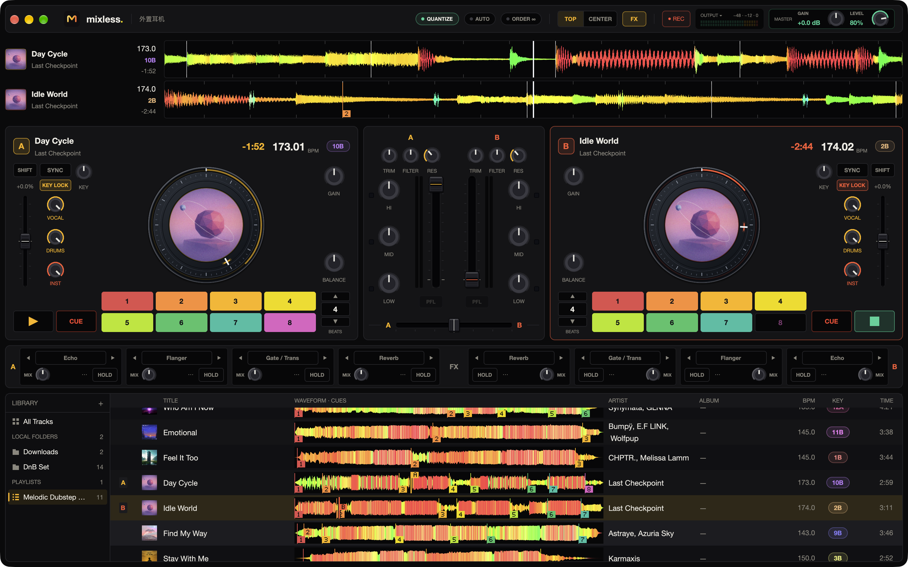
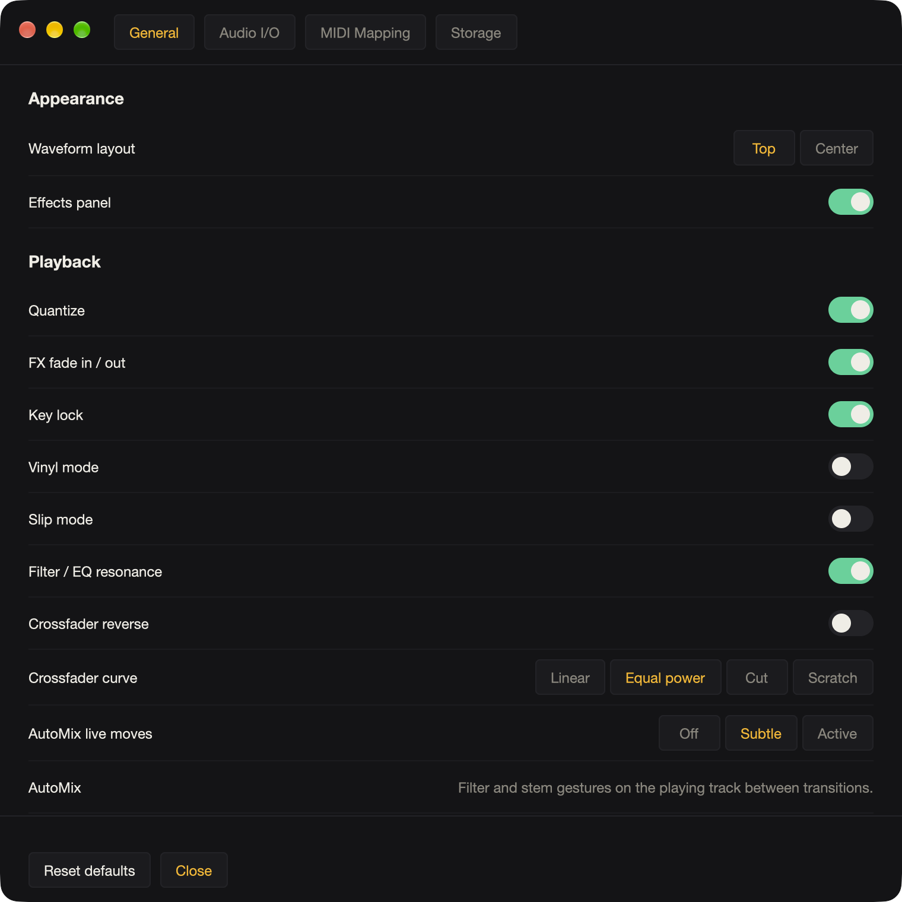

<div align="center">


<h1>Mixless</h1>

<p>
<strong>Local AI mixing / AI DJ desktop app.</strong><br>
Dual decks, offline analysis, stem-aware playlist automix — all in Rust.
</p>

<p>
<a href="https://github.com/backrunner/mixless/actions/workflows/ci.yml"></a>
<a href="https://github.com/backrunner/mixless"></a>
<a href="LICENSE"></a>
</p>

</div>



- **Audio**: Rust realtime graph (`mixless-engine` + CoreAudio)
- **UI**: [GPUI](https://github.com/zed-industries/gpui) (pure Rust, GPU-rendered, no web stack)
- **Analysis**: on-device stem separation and note tracking via ONNX Runtime — no Python, no cloud
- **License**: MPL-2.0 (optional closed-source acquire plugin is not in this tree)

v1 targets **macOS** only. Design lives in [`.agents/`](.agents/README.md).

## Workspace

```
apps/desktop/          GPUI app (mixless-desktop bin "mixless")
crates/mixless-protocol
crates/mixless-engine
crates/mixless-library
crates/mixless-analyze
crates/mixless-stems
crates/mixless-tools
crates/mixless-mixplan
crates/mixless-spotify
crates/mixless-acquire
crates/mixless-acquire-yt
crates/mixless-midi
```

`apps/desktop` must not contain DSP; it only hosts engine/library state and paints UI.

## Develop

```bash
# Build incrementally and launch the desktop development version
./dev.sh

# Check prerequisites, or build without launching
./dev.sh --check
./dev.sh --build

# Rust crates
cargo test --workspace --exclude mixless-desktop
```

Requires a current stable Rust toolchain and full Xcode (the `metal` shader
compiler is not part of the standalone Command Line Tools). `dev.sh` locates
the project even when called from another directory and automatically selects
an Xcode installation with Metal support, including Xcode-beta. An explicit
`DEVELOPER_DIR` takes precedence. Press Ctrl+C to stop; rerun after code changes
to rebuild and replace the previous instance from this checkout. Choose **Mixless → About Mixless** from the macOS menu bar to see the version, Git revision and UTC build time.
The main window keeps build metadata out of the workspace. The first
build optimizes the audio engine, GPUI and waveform tessellation for development
and may take longer. The script uses the normal local app library and does not provide
automatic file watching.

The UI mirrors `EngineSnapshot` from the engine's atomics at display VSync
while audio is active, and repaints on demand while idle — the playhead
is never integrated on the UI side.

## App icon

The continuous-wave M, with a warm gradient and soft enamel shading, appears
in the Dock, header and About window. The [branding assets](assets/branding/README.md)
include the refined image master, an opaque 1024 px sRGB store PNG, rounded
macOS assets and ICNS, and the original vector artwork. Regenerate the local icon exports with
`swift scripts/generate-icons.swift`; after building, run
`cargo run --locked -p mixless-tools -- bundle` to assemble a local unsigned `.app`.

## Preferences

Choose **Mixless > Preferences...** in the macOS menu bar or press **Cmd+,**
(the item appears as **Settings…** on recent macOS versions).
The single preferences window contains General, Audio I/O and MIDI Mapping tabs.



- General saves waveform layout, FX visibility, quantize, key lock, vinyl/slip,
  crossfader curve and reverse. Filter / EQ resonance is enabled by default and
  can be disabled here. Changes also apply to the current session.
- Audio I/O selects the master and a separate headphone output, sample rate
  (up to 96 kHz), buffer size and headphone volume. **Apply audio** reopens the
  streams; unavailable devices or unsupported formats report an error and retain
  the prior configuration. Reconfiguration briefly interrupts playback.
- PFL uses a separate pre-fader headphone bus. It remains independent of the
  channel faders and master volume, including with different device sample rates.
  No headphone output disables PFL only; hot cues remain available.
- MIDI Mapping selects enabled input devices and supports CC/note mappings,
  learning, editing, deletion and JSON import/export. Learning captures the first
  signal and suppresses performance commands until saved or canceled. Jog uses
  two's-complement relative CC. Legacy maps without a device ID match any input.
- Storage reports disk usage for the stem, analysis, waveform, artwork and
  model caches plus the library database and downloaded audio. Caches are
  regenerable and never evicted automatically; each category can be cleared
  explicitly, or scoped to a single playlist. Source audio, playlists and cue
  points are never removed by clearing.

Preferences and MIDI maps persist in `preferences.json` and `midi.json` beside
the library database. Disconnected MIDI devices can be refreshed and reconnected
with **Apply inputs**. Audio capture from microphones/Line In is not implemented.

## Keyboard shortcuts

Choose **Help → Keyboard Shortcuts** in the macOS menu bar, or press **? / F1**, to view shortcuts.
The highlighted deck receives selected-deck commands; **Tab** switches A/B.

| Keys | Action |
| --- | --- |
| Space | Play/pause selected deck |
| Z / X | Play/pause deck A / B |
| C / Shift+C | Set or return to temporary Cue / clear it |
| G | Quickly set the next empty cue pad |
| 1–8 | Selected deck hot cues 1–8 |
| Q W E R / U I O P | Deck A / B hot cues 1–4 |
| Shift + numbered cue key | Choose AUTO / IN / OUT for that saved Cue |
| S | Sync selected deck |
| L | Toggle selected deck loop |
| [ / ] | Halve/double loop size, from 1/16 to 64 beats |
| Left / Right | Jump backward/forward 1 bar |
| Shift + Left / Right | Jump backward/forward 4 bars |
| F | Center crossfader |
| Escape | Close the open panel |

Empty cue pads save the current position; existing pads jump on mouse-down without
changing playback. Click **SHIFT** to the left of SYNC, then a pad, to choose its
Automix role: **AUTO**, **IN**, or **OUT**. The keyboard Shift modifier works too.
Changing a role keeps the saved position. Right-click a pad to delete it; the next
ordinary press records a new position. Analysis fills unused pads without replacing manual edits.

The transport **CUE** is a separate, deck-local temporary point: first press saves
it, subsequent presses return immediately, and holding 400 ms clears it. A **T**
flag marks it in the scrolling waveform. Loading another track clears it.
During playback, a short Play click stops on release; holding 400 ms triggers a
continuous vinyl slowdown with falling speed and pitch, including with Key Lock
on. It keeps slowing while held; release (or window deactivation) stops playback,
and reaching EOF stops it naturally. There is no fixed brake timeout. Press Play
again to resume at the saved tempo/key settings.

Starting AUTO with empty decks starts the first playable song in list order,
including when Shuffle is on. A short entrance follows audio progress, raising
Level and optionally opening Filter for a percussive, low-vocal intro. Later
songs follow the selected sequence/shuffle mode and loop continuously.

Cue points are saved with the track. G leaves existing cues intact when all
8 slots are full. Shortcuts do not run in import/help dialogs or file pickers,
and holding a key does not repeatedly trigger an action.

The library fills the remaining window height. Use **+ Files** or **+ Folder**
for local imports (folders include subfolders; duplicate paths are skipped),
or **Spotify** for playlist import and progress details. Each local folder is
its own playlist under **LOCAL FOLDERS**: the selected root includes its subfolders,
and immediate parent folders also remain separately selectable. Folder labels
use the shortest unique name; hover reveals the full path. Reimports add files without duplicating or clearing existing
members. Existing local tracks are grouped on the next launch. Startup and
completed imports select a playlist; **All Tracks** is an explicit combined view.
Right-click any playlist to duplicate it or remove it (with confirmation);
removing a folder playlist hides the folder until it is imported again.
Native file
selection is asynchronous and folder scanning publishes rows in batches before
musical analysis completes. Additional imports can be queued while importing.
Drag anywhere on a track row to reorder the current list. The insertion line
marks the destination; hold near the list's top or bottom edge to scroll.
Drop below the last row to move a track to the end, or press **Esc** to cancel.
Manual order is saved independently for each folder, playlist and **All Tracks**.
Drag a library track onto either deck to load it; the receiving deck highlights during the drag.
Loading a track manually takes over from Automix. A and B can load independently;
audio becomes playable after decoding and waveform preparation, with beat/key
analysis attached when ready. Loaded rows show A/B badges.

Jog platters show the track's embedded cover inside a circular hub, with a
separate progress ring and rotating position marker. Covers are cropped and
resized on a background worker, and decoded previews are shared across decks
and repeat loads. Changing the visible folder keeps the loaded cover; missing
or unreadable artwork falls back to the default platter. The marker uses the
waveform's interpolated playback clock. Scratching works over the cover, and
the outer rim pulses red with a countdown near the end of a playing track.

The waveform uses 16-bit positive/negative envelopes and a darker RMS body.
Four independent spectral bands map bass to red, low-mid to yellow, high-mid
to green and treble to blue, following djay's documented color convention.
Only color energy is time-smoothed; transient positions keep source-bin precision.
Detailed data (32 source frames per bin, capped at 1,048,576 bins) persists in
the library. Background workers build multiresolution levels; drawing interpolates
between bins and levels on screen-aligned columns with antialiased edge coverage.
The display head interpolates from CoreAudio playback timestamps between blocks,
and falls back to engine position during seek, pause, scratch or device stalls.
A stable zoom scale avoids breathing with local BPM estimates. The pointer stays
fixed at the center from the first frame, including after a cue jump. Beat and downbeat markers use stored analysis;
tracks without a measured grid show no invented bar lines.

Drag a horizontal or vertical waveform to move the audio beneath its fixed
playhead. Release preserves play/pause and commits the final pointer position.
Press **SYNC / S** on the following deck to match the other deck's tempo and
beat phase; press again to disengage at the current tempo. **MASTER** identifies
the reference deck, **SYNC …** means armed/acquiring, and a filled green **SYNC**
means the grids are locked. **GRID … / NO GRID** indicates analysis in progress
or no usable grid. Old analysis caches are refreshed on a background worker.
Analysis payloads and file verification hashes persist in `library.db` across
restarts. Library refresh queues background preparation and updates each row
when it completes. Verification is reused only while the filesystem revision
(size, nanosecond modification/change times, device and inode) matches; changed
content or analysis versions trigger fresh analysis. Deck loading still checks
the decoded file against the full content hash.
SYNC can be pressed during analysis: it waits for both grids and engages
automatically. Press again to cancel; loading another track or taking manual
control cancels the pending request as well.
Master tempo changes are followed continuously, including half/double tempo
matching. Scrubbing, reverse, or changing the follower's tempo takes manual
control; enabling Automix gives its plan control of timing.
Research sources, behavior and limitations are in [BEAT_SYNC.md](.agents/reference/BEAT_SYNC.md).


## Automix

Selecting a playlist prepares its analyses and adjacent transitions, including
the last-to-first transition, in the background. `AUTO` can be enabled or disabled
during playback. It repeats the list indefinitely in sequential or shuffled order;
each shuffle cycle visits every entry before reshuffling. Files appended during
import join the running queue at the next handoff. The `AUTO` control executes
one outgoing/incoming pair at a time. It loads the
next local track in the idle deck, resolves the next transition from the
offline analyses and compiles the envelope into the audio thread. `PAUSE`,
`RESUME`, `SKIP` and direct fader/EQ/filter edits are available while a plan is
running; editing a lane takes over that lane only. User mix-in/mix-out cues are
hard constraints, hot cues are soft anchors, and an impossible cue window is
reported instead of bypassed.
Analysis keeps several entry/exit regions with local key, vocal, rhythm and
energy evidence. Pair planning compares these windows before selecting the cue
and technique. Musical spans can include long 24/48/64-bar layered blends, with separate high/bass/mid exchanges, nonlinear Level/filter/crossfader curves and optional echo exits. Valid structural cuts can be instantaneous. The library shows full-track waveforms with numbered cue flags and deck playheads; while AUTO is enabled, it also shows planned IN/OUT points and the actual mixing intervals. Playlist order and selection persist across restarts, and import refreshes preserve manually ordered tracks. While the incoming deck is paused, AUTO sets its cue, tempo,
key lock, optional harmonic shift (at most two semitones), EQ and closed level.
During the handoff the engine drives transport, filter, EQ, channel fader,
crossfader and selected FX. The transition strip shows the selected source
windows, countdown/progress, technique and live incoming controls; those windows
are highlighted on the waveforms. Decks flash red with a countdown near the end.

For a device-free preview from two files:

```bash
cargo run -p mixless-engine --example automix -- outgoing.wav incoming.wav preview.wav 128 126
```

The planner uses local tempo maps, Camelot compatibility, measured phrase
boundaries, energy/foreground/kick scoring, measured musical spans and long-overlap candidates, 1:1 and
2:1 bar maps, and inherited performance offsets. On macOS 12+, offline analysis
also attempts a bounded, on-device Apple Sound Analysis vocal classifier; no
model download or Python runtime is needed. Model failures retain the DSP result.
The original nine catalog envelopes remain available with `smooth: false`.
Performance measurements and the model roadmap are in
[ANALYSIS_ENHANCEMENT.md](.agents/reference/ANALYSIS_ENHANCEMENT.md).

[Native stem and note analysis](.agents/reference/native-inference.md) runs by
default in the desktop preparation queue. Rust drives pinned HTDemucs and Basic
Pitch ONNX models, caches vocals/drums/instruments and note evidence, and feeds
AutoMix cut safety, harmonic progression and EQ decisions. No Python, PyTorch or
external inference process is required. First use downloads verified models;
manual playback remains available during analysis or a model failure.

Prepared stems now support independent VOCAL / DRUMS / INST gain controls and
AutoMix envelopes. The voices share one transport and time stretcher per deck;
inference and PCM loading stay off the audio callback. All voices at unity preserve
the original audio. See [stem playback and performance](.agents/reference/stem-playback.md).

Implementation details, verification and current limitations are in
[AUTOMIX.md](.agents/reference/AUTOMIX.md).

The desktop interaction and performance checks are recorded in
[DJ_WORKSPACE_CHECKS.md](.agents/history/DJ_WORKSPACE_CHECKS.md). Set `MIXLESS_PROFILE_UI=1` when
launching to log CPU draw p50/p99 and observed frame intervals every 240 frames;
these timings do not measure GPU presentation or establish listening quality.

Audio DSP behavior, regression checks and remaining limitations are documented
in [AUDIO_DSP.md](.agents/reference/AUDIO_DSP.md).

## Audio effects

Each deck has four insert slots with 70 selectable audio FX. Use **⋯** on a slot
for the grouped catalogue, beat timing and parameter editor. See
[FX_CATALOGUE.md](.agents/reference/FX_CATALOGUE.md) for the Rekordbox/djay category comparison and
[AUDIO_DSP.md](.agents/reference/AUDIO_DSP.md) for algorithms and validation limits.

## Contributing

See [CONTRIBUTING.md](CONTRIBUTING.md) for checks and Conventional Commits.

## Legal

Mixless is licensed under the [Mozilla Public License 2.0](LICENSE); see
[NOTICE](NOTICE) for copyright and attribution. Bundled and separately installed
third-party components are listed in [THIRD_PARTY_NOTICES.md](THIRD_PARTY_NOTICES.md).
Data handling is described in [PRIVACY.md](PRIVACY.md), and vulnerability
reports go through [SECURITY.md](SECURITY.md).
