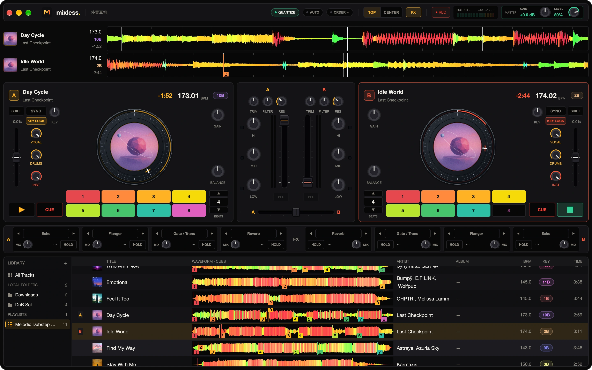

<div align="center">


# mixless

**Your tracks. One continuous flow.**

A native Mac DJ workspace with local AI analysis, dual decks, and musical AutoMix.

[Website](https://mixless.alkinum.com) · [User guide](https://mixless.alkinum.com/docs) · [中文指南](https://mixless.alkinum.com/docs/zh) · [Download](https://mixless.alkinum.com/download)

[](https://github.com/backrunner/mixless/actions/workflows/ci.yml)
[](https://github.com/backrunner/mixless/releases)
[](LICENSE)

</div>

[](assets/screenshots/workspace.png)

mixless turns a folder of music into a continuous set. Mix by hand, let AutoMix plan the handoffs, or take control whenever you want. Built in Rust with a GPU-rendered [GPUI](https://github.com/zed-industries/gpui) interface and a native audio engine.

- **Musical AutoMix.** Plans around phrases, tempo, key, energy and vocals, with blends, bass swaps, build-up-to-drop cuts, spinbacks and loop-outs. Your IN/OUT cues set the boundaries; optional live moves add filter and stem gestures between transitions.
- **Hands-on decks.** Beat sync, key lock, hot cues, loops, scratching, four FX slots per deck and 70 effects.
- **Local AI preparation.** On-device stem separation and note analysis. Shape vocals, drums and instruments independently; no cloud inference or Python runtime.
- **Your library.** Queue folder imports, organize playlists, reorder tracks by dragging, and bring in Spotify playlist metadata. Reconnect moved files automatically or locate them yourself while preserving playlists and manual cues.
- **Your setup.** Separate master and headphone outputs, independent deck/master gain and limiters, persistent preferences, and MIDI learning and mapping for decks, mixer and library controls.

Audio and analysis stay on your Mac. Choose the standard installer (verified models download on first use) or the installer with models for offline stem analysis on Apple Silicon. Spotify supplies metadata, not mixing audio; optional audio acquisition requires separately installed tools. See [Privacy](PRIVACY.md).

## Current beta

mixless is in active beta development. The **0.1.0-beta.3** source includes:

- Improved tempo, phrase and drop analysis, with more flexible handoffs through measured recovery passages and clearer respect for build-ups and manual cues.
- Spinback and loop-out transitions, configurable **Live moves**, and automatic overlap gain compensation that yields to manual control.
- Background folder imports, per-playlist drag ordering, missing-file recovery, and expanded MIDI controls.
- Safer signed updates, library compatibility backups, and recording finalization.
- A refreshed About window, consistent lowercase branding, and a bilingual website with Retina product images, accessible motion and automatic release downloads.

Analysis and transition choices remain estimates: preview unfamiliar pairs before using them in a set. See [release notes](https://github.com/backrunner/mixless/releases) for version-specific changes and known limitations.

## Get started

Download a macOS installer from [the direct download](https://mixless.alkinum.com/download), open the DMG, and move mixless to Applications. The app targets **macOS 12+**, with Apple Silicon and Intel release builds. The download selects the latest stable release, falling back to the latest beta when no stable release exists. [Other download options](https://mixless.alkinum.com/#downloads) include an installer with models, beta, previous releases, checksums, and source code. Both installers use the same app and library; automatic updates preserve the installed variant. Stem and note inference requires Apple Silicon; including models does not enable inference on Intel.

Published installers are universal, Developer ID signed and Apple notarized. Release builds check their own stable or beta update channel; use **mixless → Check for Updates…** to check manually, then restart when prompted. Development builds do not install public updates. Open **About mixless** to see and copy the version, channel and build details.

1. Add music with **+ Files** or **+ Folder**.
2. Check your output in **mixless → Preferences…** (**Cmd+,**).
3. Select a playlist and press **AUTO**, or drag a track onto a deck and press Play.

See the [first-mix guide](apps/site/content/docs/index.md), [AutoMix guide](apps/site/content/docs/automix.md), [MIDI guide](apps/site/content/docs/midi.md), and [keyboard shortcuts](apps/site/content/docs/shortcuts.md). The [official site](https://mixless.alkinum.com/docs) contains the full English and Chinese handbook.

## Develop

Requires current stable Rust and full Xcode with the Metal compiler.

```bash
./dev.sh --check       # Check prerequisites
./dev.sh               # Build and launch
./dev.sh --build       # Build without launching

cargo test --locked --workspace --exclude mixless-desktop
cargo test --locked -p mixless-desktop
```

The first build may take longer. The script selects an Xcode installation with Metal support, respects `DEVELOPER_DIR`, and uses your normal local app library. Rerun it after code changes. Version, revision and build time appear in **mixless → About mixless**.

| Path | Contents |
| --- | --- |
| `apps/desktop` | Native GPUI application |
| `apps/site` | Official website and bilingual guide, built with svedocs |
| `crates/mixless-engine`, `mixless-protocol` | Real-time audio, commands and snapshots |
| `crates/mixless-library` | Library and playlists |
| `crates/mixless-analyze`, `mixless-stems`, `mixless-mixplan` | Analysis, local inference and transition planning |
| `crates/mixless-midi` | Controller mapping |
| `crates/mixless-spotify`, `mixless-acquire*` | Playlist metadata and optional audio acquisition |
| `crates/mixless-tools` | Packaging and release helpers |

## Website

The site uses **svedocs 0.2.1**, with a custom landing page, local search, and complete English/Chinese content. Cloudflare Workers serves the static pages and resolves the latest release for direct downloads. Requires Node.js 22.12+ and pnpm.

```bash
pnpm -C apps/site install --frozen-lockfile
pnpm -C apps/site dev

pnpm -C apps/site check
pnpm -C apps/site check:content
pnpm -C apps/site test:releases
pnpm -C apps/site build
pnpm -C apps/site exec playwright install chromium
pnpm -C apps/site test:e2e
```

See [apps/site/README.md](apps/site/README.md) for content, asset and hosting instructions.

The [mixless brand skill](.agents/skills/mixless-brand/SKILL.md) defines naming, typography, icon shape, motion and screenshot requirements. `pnpm -C apps/site assets` regenerates website images and the rounded README assets from the shared icon master and original native captures.

## Contribute & license

Read [CONTRIBUTING.md](CONTRIBUTING.md) for contribution checks and [RELEASING.md](RELEASING.md) for signed macOS releases. Engineering references remain in [`.agents/`](.agents/README.md).

mixless is licensed under [MPL 2.0](LICENSE). See [NOTICE](NOTICE), [third-party notices](THIRD_PARTY_NOTICES.md), [privacy](PRIVACY.md), and [security reporting](SECURITY.md).
